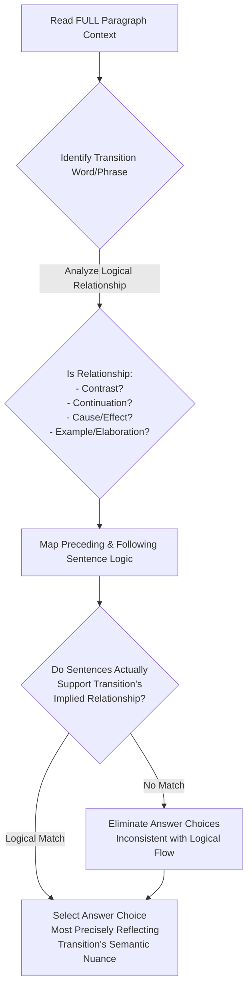
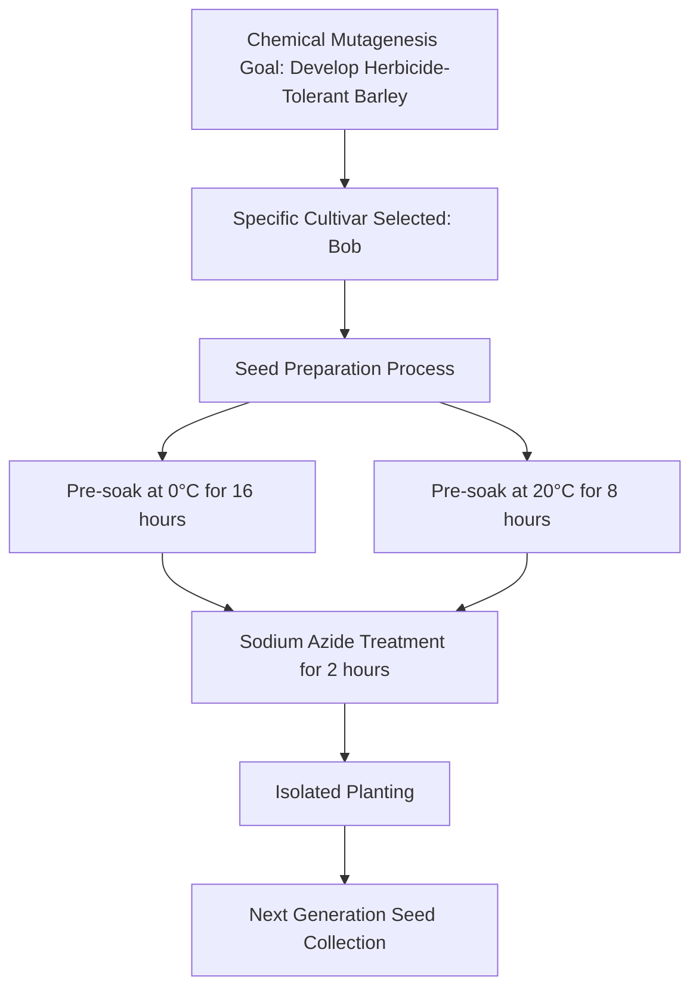

# SAT Reading Tutorial: Transitions

# Introduction

Mastering Transitions in SAT Reading: Natural Sciences Edition

Transition questions are like the hidden hinges that connect ideas in scientific passages, and understanding them can be your secret weapon on the SAT Reading section. These questions typically ask you to "identify the relationship between sentences" or "choose the most logical transition that connects two ideas" using stems like "Which choice best shows the relationship between the previous and following sentences?" or "The author uses the transition to primarily…"

Why do these questions matter? They're not just about grammar—they're about comprehension. In Natural Sciences passages, particularly in life sciences, transitions reveal how scientific ideas evolve, connect, and build upon each other. A well-chosen transition can show contrast, support, cause and effect, or provide crucial context in complex biological or research-based texts.

Imagine you're reading a passage about cellular adaptation, and suddenly you need to determine how two seemingly different paragraphs relate. Is it a contrast? A continuation of an idea? This is where transition skills become critical. Life sciences passages often use transitions to explain complex processes, show evolutionary relationships, or highlight research methodology shifts.

Here's a quick exam-day scenario: You're reading a passage about genetic mutations, and you see sentences that seem disconnected. Your transition radar should immediately activate. Look for signal words like "however," "consequently," or "similarly" that reveal the underlying logical connection.

Pro Tip: In Natural Sciences passages, always ask yourself, "How do these scientific ideas logically connect?" This mindset will help you navigate transition questions with confidence and precision.

# General Strategy

Key Design Principles:
- Forces systematic logical analysis
- Emphasizes understanding context
- Creates verification checkpoints
- Prevents hasty/superficial selection
- Teaches critical thinking, not just "tricks"

Would you like me to elaborate on any specific node or reasoning pathway?

# Practice

## Let's Practice

Here's a typical SAT Reading Natural Sciences passage that tests Transitions skills:

Chemical mutagenesis has proven effective in developing crop varieties with desirable traits. In a recent study, researchers sought to create herbicide-tolerant barley plants. The process began with selecting the barley cultivar Bob for treatment with sodium azide. _____ the seeds required careful preparation, they were first pre-soaked at 0°C for 16 hours and then at 20°C for 8 hours. Following this preparation, the seeds were treated with sodium azide for 2 hours. The treated seeds were then planted in isolation, and the resulting plants were harvested to collect the next generation of seeds.

Now, try this question:

Which choice completes the text with the most logical transition?

Consider these options:
- A) However,
- B) Because
- C) Therefore,
- D) Similarly,

Take a moment to think about your approach before reading the solution.

# Understanding the Passage

SAT Reading Natural Sciences Passage Analysis Guide

Active Reading Approach:
1. First Pass: Identify the core scientific process
  - Underline key scientific terms: "chemical mutagenesis", "sodium azide", "herbicide-tolerant"
  - Circle numerical data and experimental conditions
  - Mark the experimental progression (seed selection → preparation → treatment → isolation)

Key Textual Features:
- Objective, technical language
- Precise experimental methodology
- Quantitative measurements (temperatures, time durations)
- Focused on practical scientific application (crop development)

Scientific Passage Characteristics:
- Methodical description of research process
- Clear cause-and-effect structure
- Emphasis on reproducible experimental steps
- Neutral, informative tone

SAT-Tested Concept Examples:
1. Experimental Precision
  - Specific temperature stages: "0°C for 16 hours" and "20°C for 8 hours"
  - Demonstrates scientific rigor in experimental design

2. Research Methodology
  - Quote: "seeds were treated with sodium azide for 2 hours"
  - Highlights systematic approach to genetic modification

Transition Question Strategy:
Main Idea: Chemical mutagenesis as a technique for developing improved crop varieties

Author's Purpose: To explain a specific scientific method for creating herbicide-resistant barley

Transition Question Approach:
- Identify logical flow between experimental stages
- Look for words indicating progression or causality
- Understand how each experimental step connects to the next

Critical Reading Tactics:
- Track the experimental sequence
- Note specific scientific procedures
- Understand the research's practical implications
- Recognize the systematic nature of scientific investigation

Key Takeaway:
Successful comprehension requires:
1. Active annotation
2. Understanding scientific terminology
3. Tracking experimental logic
4. Recognizing the research's broader context

By applying these strategies, students can confidently navigate complex scientific passages, breaking down intricate experimental descriptions into clear, comprehensible steps.

Recommended Student Approach:
- Read slowly and deliberately
- Mark key scientific terms
- Visualize the experimental process
- Connect each step's purpose and significance

This analytical framework transforms a dense scientific text into an accessible, structured narrative of scientific discovery.

# Visual Analysis

# Step-by-Step Solution

Step-by-Step Solution:

1. Rephrasing the Question:
"What transition best connects the idea of seed treatment with the specific preparation steps?"

2. Evidence Analysis:
Key passage context: The text describes a precise mutagenesis process involving seed preparation before sodium azide treatment.

Critical observation: The seeds undergo a specific multi-step preparation before chemical treatment.

3. Elimination Strategy:
- "However" (A): Implies contradiction, which doesn't match the sequential preparation steps
- "Similarly" (D): Suggests comparison to a previously described process, but no prior context exists
- "Therefore" (C): Suggests a direct logical consequence, but the preparation seems more explanatory
- "Because" (B): Explains the rationale behind the detailed preparation steps ✓

4. Reasoning for Correct Choice:
"Because" logically introduces the detailed explanation of why seeds require careful preparation:
- Provides causal connection
- Signals that the subsequent details explain the preparation's necessity
- Matches scientific writing's explanatory style

Specific Evidence:
- The preparation involves precise temperature-controlled soaking (0°C, 20°C)
- Suggests methodical scientific approach requiring justification

5. Test-Taking Reflection:
Quick reasoning steps:
- Identify the logical flow
- Look for causal relationships
- Eliminate choices that disrupt scientific explanation
- Choose the transition that most naturally introduces explanatory details

Recommended Approach:
- Read surrounding sentences carefully
- Understand the scientific process being described
- Select the transition that best maintains logical coherence

Correct Answer: B) Because

Rationale: "Because" introduces the detailed seed preparation steps as a necessary explanation for the mutagenesis process, maintaining the scientific text's logical progression and providing clear causal context.

Key Takeaway: In scientific passages, transitions should clarify relationships between ideas, especially when describing methodical processes.

# Key Strategies

SAT Reading Transitions Strategy for Natural Sciences Passages

Core Reading Approach:
Natural Sciences passages require a precise, analytical reading style focused on logical progression and scientific reasoning. Key techniques include:
- Tracking causal relationships between scientific concepts
- Identifying precise semantic shifts in research descriptions
- Recognizing how scientific arguments develop incrementally

Transition Question Strategies:
1. Keyword Detection
- Look for signal words: "however", "consequently", "nevertheless"
- Analyze how these words indicate logical relationships
- Understand how scientific arguments pivot or expand

2. Evidence Identification Techniques
- Always reference line numbers explicitly
- Create quick mental summaries of paragraph transitions
- Note how scientific evidence builds or challenges previous claims

Common SAT Transition Traps:
- Seemingly plausible but contextually incorrect connections
- Subtle logical misalignments
- Transitions that sound scientific but lack precise meaning
- Choices that disrupt the passage's technical coherence

Time Management:
- Allocate 12-13 minutes per passage
- Spend 2-3 minutes initially scanning transition points
- Practice identifying transition logic within 30-45 seconds
- Flag challenging transitions for quick revisit

Practical Preparation Steps:
- Analyze past SAT Natural Sciences passages
- Practice extracting core argumentative threads
- Develop rapid pattern recognition for scientific reasoning
- Complete timed transition-focused practice sets

Critical Practice Recommendation:
Simulate real test conditions by practicing with official College Board materials, focusing specifically on scientific reasoning and logical progression.

By systematically applying these strategies, students can significantly improve their performance on Natural Sciences Transition questions.

# Moving Forward

Here's a concise conclusion for Transitions questions in Natural Sciences passages:

Mastering Transitions questions ultimately requires a disciplined approach focused on close textual evidence and logical relationships between scientific ideas. The key is training yourself to read carefully, tracking how authors connect scientific concepts and build logical arguments through strategic word choices.

When practicing, always prioritize direct textual support over intuitive-sounding answers. Many students mistakenly select transitions that feel right but lack concrete connection to the passage's actual logical structure. Instead, systematically analyze how each transition word signals a specific relationship—contrast, continuation, example, or consequence.

Remember that improving your Transitions skills isn't just about test performance—it's about developing a more sophisticated scientific reading comprehension. By becoming more attentive to subtle linguistic signals, you'll not only boost your score but also enhance your ability to understand complex scientific reasoning across disciplines.

Stay patient, stay precise, and trust the process.

## Time Management Guidelines
- Reading Time: 1 minutes
- Solving Time: 1 minutes

## Expert Tip 
Look for signaling words or phrases that indicate logical shifts or additions.