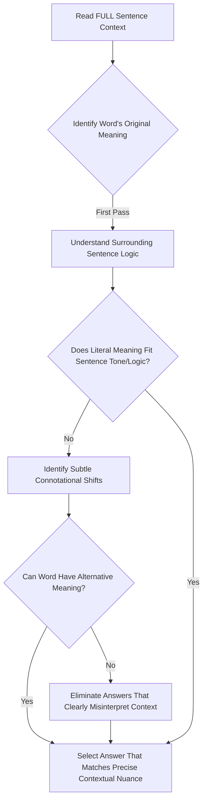
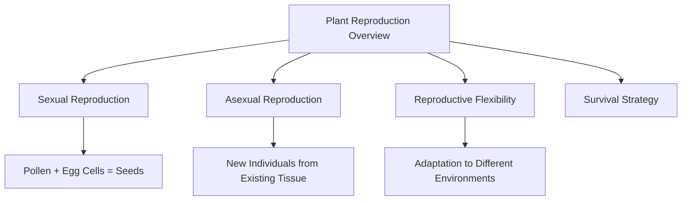

# SAT Reading Tutorial: Words in Context

# Introduction

Mastering Words in Context: Your Strategic Guide for SAT Reading

When you encounter a Words in Context question in the SAT Reading section, especially within Natural Sciences passages, you're not just decoding vocabulary—you're demonstrating your ability to understand how language operates dynamically within complex scientific texts. These questions typically ask you to "determine the meaning of a word as used in the passage" or "interpret the word's significance in context," challenging you to look beyond dictionary definitions and analyze how scientific language conveys precise meaning.

Why are these questions crucial? They're your opportunity to showcase sophisticated reading comprehension. In Natural Sciences passages, particularly those exploring life sciences, words often carry nuanced technical or descriptive weight that goes far beyond simple definitions. A term like "adaptation" in a biology text, for instance, means something far more specific than its everyday usage.

Imagine you're midway through a passage about cellular research, and suddenly you're asked about the word "regulate" in a complex sentence. Your goal is to understand how that word functions within the scientific argument—not just memorize its generic meaning. The key is context: How does the surrounding text illuminate the word's specific role?

Quick Tip: In Natural Sciences passages, always scan the sentences immediately surrounding the highlighted word. Scientific writing typically provides contextual clues through precise language, logical relationships, and technical descriptions.

By approaching Words in Context strategically, you transform a potentially tricky question into an opportunity to demonstrate your analytical reading skills. You're not just answering a question—you're proving your ability to think like a scientific reader.

# General Strategy

Key Design Rationale:
- Emphasizes contextual comprehension over pure definition memorization
- Shows systematic critical thinking process
- Highlights importance of connotation vs. denotation
- Creates clear decision tree for strategic analysis
- Focuses on active reasoning, not passive recognition

The diagram reflects expert SAT reading strategy: always prioritize sentence-level understanding before selecting vocabulary definitions.

# Practice

## Let's Practice

Here's a typical SAT Reading Natural Sciences passage that tests Words in Context skills:

Plants have developed remarkable ways to reproduce and maintain their species over time. While some plants can only reproduce through one method, many species are capable of _____ themselves through multiple reproductive strategies. The most common method is sexual reproduction, where pollen combines with egg cells to form seeds. However, some plants can also reproduce asexually, creating new individuals directly from their existing tissue. This flexibility in reproduction methods has helped plants adapt to various environmental conditions and ensure their survival across different habitats.

Now, try this question:

Which choice completes the text with the most logical and precise word or phrase?

Consider these options:
- A) propagating
- B) extending
- C) spreading
- D) multiplying

Take a moment to think about your approach before reading the solution.

# Understanding the Passage

SAT Reading Passage Analysis: Plant Reproduction Strategies

Active Reading Approach:
When approaching this passage, students should:
- Underline key scientific terms (e.g., "sexual reproduction," "asexual reproduction")
- Circle the main idea and any transitional phrases
- Annotate the central argument about plant reproductive flexibility

Key Passage Characteristics:
1. Informative scientific tone
2. Explanatory structure focusing on biological adaptation
3. Concise, fact-driven language typical of natural sciences passages

Critical Analysis:

Main Idea: Plants have developed multiple reproductive strategies that enable species survival and adaptation.

Structural Breakdown:
- Opening statement introduces the broad concept of plant reproduction
- Highlights the complexity of reproductive methods
- Emphasizes evolutionary advantage of reproductive flexibility

SAT-Tested Concept Examples:

1. Reproductive Diversity Quote: "While some plants can only reproduce through one method, many species are capable of _____ themselves through multiple reproductive strategies."
- Tests understanding of biological variation
- Suggests adaptability as a key survival mechanism

2. Reproductive Methods Quote: "The most common method is sexual reproduction, where pollen combines with egg cells to form seeds. However, some plants can also reproduce asexually, creating new individuals directly from their existing tissue."
- Demonstrates scientific explanation of biological processes
- Illustrates comparative analysis of reproductive techniques

Words in Context Strategy:
- Identify the passage's scientific context
- Understand how specific terms relate to the broader biological discussion
- Look for nuanced meanings within the scientific framework

Key Reading Tactics:
- Read actively and critically
- Identify the author's purpose (explaining plant reproduction mechanisms)
- Recognize the passage's logical progression
- Anticipate potential comprehension questions

Practical Approach for Students:
1. First read: Get overall understanding
2. Second read: Annotate and analyze specific details
3. Focus on main ideas and scientific explanations
4. Practice extracting key information efficiently

By applying these strategies, students can confidently navigate scientific passages, understanding both the literal content and the underlying scientific reasoning.

# Visual Analysis

# Step-by-Step Solution

Step-by-Step Solution for Words in Context Question:

1. Rephrasing the Question:
"Which word best describes how plants can create new individuals through different reproductive methods?"

2. Evidence Analysis:
Key textual evidence:
- "reproduce through multiple reproductive strategies"
- "sexual reproduction... pollen combines with egg cells"
- "asexually, creating new individuals directly from their existing tissue"

The passage explicitly discusses how plants can generate new plant individuals through different methods, suggesting a technical, biological term is needed.

3. Elimination Strategy:
- B) "extending" - Too vague, implies stretching rather than reproduction
- C) "spreading" - Suggests geographic distribution, not biological reproduction
- D) "multiplying" - Close, but lacks scientific precision
- A) "propagating" ✓ - Scientifically precise term for biological reproduction

4. Rationale for Correct Choice:
"Propagating" precisely matches the scientific context:
- Covers both sexual and asexual reproduction methods
- Technically describes how plants generate new individuals
- Aligns with biological terminology
- Reflects the passage's emphasis on reproductive flexibility

5. Test-Taking Reflection:
Quick elimination steps:
- Identify key scientific context
- Look for most precise technical term
- Match word's meaning to passage's scientific description
- Avoid overly general or imprecise language

Correct Answer: A) propagating

Reasoning demonstrates:
- Close reading
- Scientific vocabulary understanding
- Contextual interpretation
- Precise language selection

Time-Pressed Approach:
1. Quickly scan passage context
2. Identify scientific theme
3. Match most precise technical term
4. Eliminate vague or imprecise choices

This systematic approach helps students confidently navigate Words in Context questions in scientific passages.

# Key Strategies

SAT Reading: Words in Context Strategies for Natural Sciences Passages

Core Reading Approach:
For Natural Sciences passages, prioritize understanding the scientific argument's logical progression. Focus on:
- Identifying key scientific terminology
- Tracking how technical language supports the central hypothesis
- Recognizing subtle tone shifts in scientific discourse

Efficient Decoding Techniques:
1. Quick Context Analysis
- Immediately scan surrounding sentences when encountering a Words in Context question
- Look for:
  * Synonyms or conceptual synonyms
  * Contextual tone indicators
  * Semantic relationships between scientific terms

2. Evidence Extraction Tactics
- Circle key nouns and verbs near the target word
- Note emotional/analytical language markers
- Cross-reference line references systematically

Common SAT Traps to Avoid:
- Overly complex answer choices
- Answers that sound scientifically sophisticated but don't match context
- Choices that introduce unwarranted emotional interpretations
- Answers disconnected from paragraph's core scientific argument

Time Management Strategies:
- Allocate 12-13 minutes per passage
- Spend 30-45 seconds per Words in Context question
- Practice rapid elimination of obviously incorrect answers
- Mark challenging questions to revisit if time permits

Practice Optimization:
- Use official College Board practice materials
- Complete timed, full-length practice tests
- Analyze error patterns in scientific vocabulary questions
- Review scientific journal articles to improve technical comprehension

Key Study Recommendations:
- Build scientific vocabulary through targeted reading
- Practice active reading in scientific texts
- Develop quick pattern recognition skills
- Learn to distinguish subtle semantic nuances

Recommended Daily Practice:
- Read one scientific article/passage
- Identify 3-5 challenging vocabulary words
- Understand their contextual usage
- Create personal flashcards with scientific context

By systematically applying these strategies, students can significantly improve their performance on SAT Reading Words in Context questions, particularly in Natural Sciences passages.

# Moving Forward

Mastering Words in Context in Natural Sciences passages requires a strategic approach centered on close textual analysis and scientific precision. Always ground your word choice interpretation directly in the passage's evidence, paying careful attention to the surrounding scientific context and the author's precise technical language. A common pitfall is selecting an answer that merely sounds plausible rather than one definitively supported by the text's logical structure and scientific reasoning.

To improve, practice actively tracking how scientific terminology functions within complex passages, noting subtle shifts in tone and technical meaning. Develop the habit of carefully examining each word's role in conveying scientific information, treating vocabulary as a precise analytical tool rather than a passive element.

Remember: Words in Context questions are not just about vocabulary, but about understanding how language communicates scientific ideas. By approaching these questions with methodical attention and intellectual curiosity, you'll not only improve your test performance but also enhance your scientific reading comprehension.

## Time Management Guidelines
- Reading Time: 1 minutes
- Solving Time: 1 minutes

## Expert Tip 
Notice how the text defines or contrasts a word, and double-check that the meaning fits the broader context.