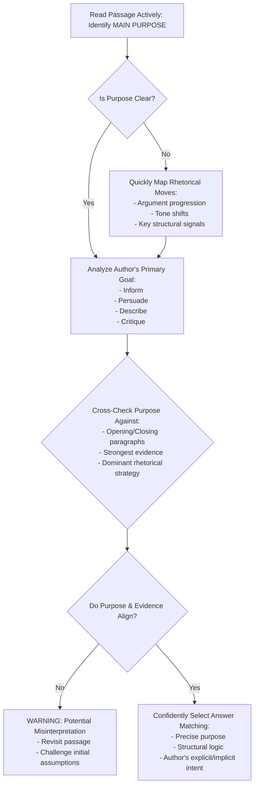
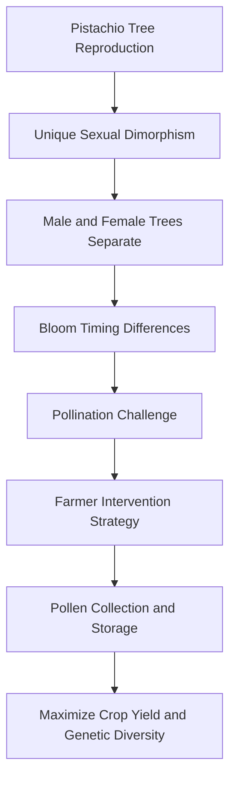

# SAT Reading Tutorial: Text Structure and Purpose

# Introduction

Text Structure and Purpose Questions in Natural Sciences: Your Strategic Guide

When you encounter Text Structure and Purpose questions in SAT Reading, especially within Natural Sciences passages, you're essentially being asked to become a scientific detective. These questions typically ask you to identify why an author wrote a specific passage, how information is organized, or the primary purpose behind a particular section of text.

Common question stems include: "The primary purpose of the passage is to...", "The author's main approach in discussing the research is...", or "The structure of the paragraph suggests that the writer aims to...". These questions are critical because they test your ability to move beyond surface-level comprehension and understand the deeper strategic choices authors make when presenting scientific information.

Natural Sciences passages, particularly in life sciences, often use specific structural techniques: comparing research methodologies, explaining complex biological processes, or tracing the development of scientific understanding. A typical life sciences text might, for instance, introduce a biological mechanism, explain its components, and then discuss its broader implications.

Imagine you're midway through the reading section, and you see a passage about cellular communication. A quick strategy is to immediately identify the passage's "skeleton"—its main sections and how they connect. Is it describing a process? Comparing theories? Evaluating a scientific problem?

Quick Tip: Always look for signal phrases like "consequently," "however," or "in contrast" to understand how the author is structuring scientific information and building their argument.

By mastering Text Structure and Purpose questions, you're not just reading—you're analyzing how scientific knowledge is constructed and communicated. Stay focused, be strategic, and trust your analytical skills.

# General Strategy

The diagram captures a strategic, methodical approach that experienced SAT tutors recommend for Text Structure and Purpose questions.

# Practice

## Let's Practice

Here's a typical SAT Reading Natural Sciences passage that tests Text Structure and Purpose skills:

The pistachio tree presents a fascinating example of specialized plant reproduction. Unlike many common fruit trees, pistachios have separate male and female trees, each producing their own distinct flowers. Commercial growers must carefully manage pollination to ensure a successful crop. The female trees produce clusters of small, delicate flowers that await pollen from their male counterparts. Interestingly, male trees typically bloom earlier in the season than females. To address this timing mismatch, farmers collect pollen from male flowers when available and store it in cool conditions until female flowers are ready. This careful timing and storage process helps maximize crop yields and maintain genetic diversity in pistachio orchards. Without such careful management, natural wind pollination alone would be far less efficient for commercial production.

Now, try this question:

Which choice best describes the main purpose of this passage?

Consider these options:
- A) To explain how commercial pistachio growers manage pollination challenges
- B) To compare male and female pistachio trees
- C) To argue for better farming practices in pistachio orchards
- D) To describe the history of pistachio cultivation

Take a moment to think about your approach before reading the solution.

# Understanding the Passage

SAT Reading Strategy: Analyzing the Pistachio Reproduction Passage

Active Reading Approach:
When first encountering this passage, students should:
- Underline key scientific terms (e.g., "pollination," "male and female trees")
- Circle main ideas about reproductive strategies
- Note the progression from biological description to agricultural practice
- Mark any surprising or unique information (separate male/female trees)

Key Textual Features:
1. Scientific Explanation Style
- Objective, informative tone
- Focuses on biological mechanism
- Blends botanical description with practical agricultural implications
- Uses precise, technical language

Main Idea Breakdown:
The passage explains the unique reproductive system of pistachio trees, emphasizing how specialized pollination requires deliberate human intervention to ensure crop production.

Specific SAT-Tested Concepts:

Concept 1: Reproductive Specialization
Quote: "Unlike many common fruit trees, pistachios have separate male and female trees"
- Demonstrates biological variation
- Highlights complexity of plant reproduction
- Shows how species develop unique survival strategies

Concept 2: Human Agricultural Management
Quote: "farmers collect pollen from male flowers when available and store it in cool conditions"
- Illustrates human technological intervention
- Demonstrates scientific problem-solving
- Shows adaptation to natural biological limitations

Purpose and Structure:
The author's purpose is to:
- Explain a specialized botanical reproductive process
- Describe agricultural techniques
- Highlight the complexity of plant reproduction

Reading Strategy:
1. First read: Get overall understanding
2. Second read: Annotate and analyze details
3. Look for cause-effect relationships
4. Identify scientific reasoning patterns

Key Takeaway:
This passage demonstrates how scientific writing combines descriptive explanation with practical application, requiring readers to synthesize biological information and understand complex systems.

Recommended Student Approach:
- Read actively
- Identify main scientific concepts
- Look for cause-effect relationships
- Understand both biological mechanism and human intervention

By applying these strategies, students can effectively navigate complex scientific passages and confidently answer SAT reading comprehension questions.

# Visual Analysis

# Step-by-Step Solution

Step-by-Step Solution:

1. Rephrasing the Question:
"What is the primary goal of the author in writing this passage about pistachio tree reproduction?"

2. Evidence Analysis:
Key evidence points:
- Focus on pollination process
- Detailed explanation of male/female tree interactions
- Emphasis on commercial growing strategies

Critical quote: "To address this timing mismatch, farmers collect pollen from male flowers when available and store it in cool conditions until female flowers are ready."

This quote reveals the passage's central explanatory purpose about pollination management.

3. Eliminating Trap Choices:
- Choice B: Partially true but too narrow; comparison is not the main purpose
- Choice C: No argumentative tone; passage is descriptive, not persuasive
- Choice D: No historical context provided; purely focused on current cultivation techniques

4. Confirming Correct Choice (A):
Why it matches:
- Directly addresses the passage's technical explanation
- Captures the detailed description of pollination challenges
- Aligns with Natural Sciences text structure: informative and process-oriented
- Meets SAT reading standards by focusing on main informational purpose

5. Test-Taking Strategy:
Quick reasoning under pressure:
- Scan for central focus
- Identify key technical details
- Look for comprehensive explanation
- Avoid choices with extreme language
- Prioritize the most comprehensive, evidence-supported option

Reflection: The correct answer (A) comprehensively captures the passage's purpose of explaining the intricate pollination management in pistachio cultivation.

Reasoning Process:
1. Identify main topic (pistachio reproduction)
2. Recognize technical explanation style
3. Match passage content to answer choices
4. Eliminate less accurate options
5. Confirm most precise description

Key Takeaway: Focus on the passage's primary informational goal, not peripheral details.

Recommended Time: 30-45 seconds per purpose/structure question.

# Key Strategies

SAT Reading Strategies for Natural Sciences Text Structure and Purpose Questions

Core Reading Approach:
For Natural Sciences passages, adopt a strategic reading method that prioritizes understanding the scientific argument's progression. Focus on:
- Identifying the primary research question or hypothesis
- Tracking how evidence supports or challenges the central claim
- Noting methodological transitions and experimental reasoning

Key Techniques:
1. Active Reading Strategies
- Underline key scientific terminology
- Mark structural shifts in argument
- Create quick margin notes about paragraph function
- Highlight cause-effect relationships

2. Evidence Identification Tactics
- Look for signal phrases like "consequently," "however," "moreover"
- Pay attention to transition sentences that indicate research progression
- Recognize how each paragraph contributes to overall scientific explanation

Common SAT Traps to Avoid:
- Misinterpreting nuanced scientific language
- Confusing descriptive versus analytical paragraph purposes
- Overlooking subtle argument qualifications
- Assuming linear progression in complex scientific arguments

Time Management:
- Allocate 12-13 minutes per passage
- First pass: 3-4 minutes reading
- Second pass: 5-6 minutes answering questions
- Reserve 2-3 minutes for review/verification

Practice Optimization:
- Use official College Board practice materials
- Analyze scientific journal article structures
- Practice extracting main ideas quickly
- Develop scientific vocabulary comprehension

Critical Performance Boosters:
- Practice identifying implicit versus explicit arguments
- Learn to distinguish between observation, hypothesis, and conclusion
- Develop rapid pattern recognition in scientific reasoning

Recommended Study Approach:
- Complete 2-3 timed practice passages weekly
- Review incorrect answers forensically
- Build scientific reading stamina progressively

By systematically applying these strategies, students can significantly improve their performance on Natural Sciences Text Structure and Purpose questions.

# Moving Forward

Mastering Text Structure and Purpose in Natural Sciences passages requires a disciplined approach centered on close textual evidence and analytical thinking. The key is to consistently trace how authors construct arguments, organize scientific information, and communicate complex ideas. When practicing, focus on identifying the underlying rhetorical strategies—whether comparing research methods, explaining experimental outcomes, or synthesizing scientific observations.

A common pitfall is selecting answers that superficially sound scientific without directly connecting to the passage's specific language and logic. Always ground your interpretation in explicit textual support, carefully matching the passage's tone and structural cues.

Practice active reading by annotating passages, mapping out their logical progression, and critically examining how each paragraph contributes to the overall scientific argument. By developing these skills, you'll not only improve your test performance but also enhance your ability to comprehend and critically engage with scientific texts.

Stay curious, stay analytical, and trust the evidence.

## Time Management Guidelines
- Reading Time: 2 minutes
- Solving Time: 1.5 minutes

## Expert Tip 
Identify how paragraphs and transitions lead to the author's main argument and shape the overall structure.