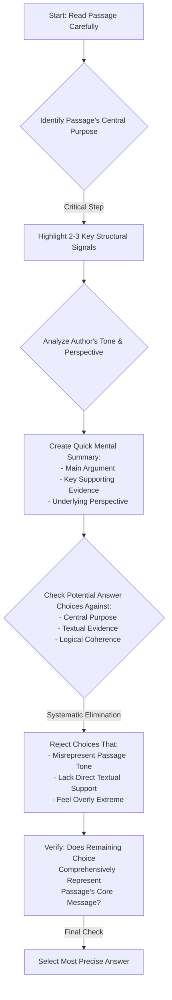
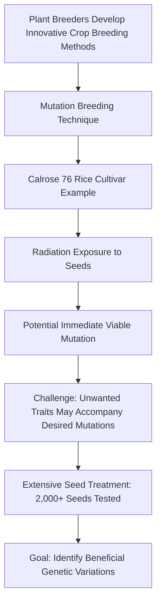

# SAT Reading Tutorial: Central Ideas and Details

# Introduction

Mastering Central Ideas and Details in SAT Reading: Your Natural Sciences Strategy Guide

When you're facing the SAT Reading section, Central Ideas and Details questions are your secret weapon for maximizing your score—especially in Natural Sciences passages. These questions typically ask you to identify main arguments, summarize key points, or explain how specific details support broader scientific concepts. You'll see question stems like "The primary purpose of the passage is...", "Which statement best describes the central idea...", or "The author uses the example of X to illustrate..."

Why do these questions matter? They're not just about reading comprehension—they're about understanding how scientific arguments are constructed. In Life Sciences passages particularly, you'll need to track how specific research findings or biological mechanisms connect to larger explanatory frameworks.

Imagine you're sitting in the testing room, and a passage about cellular metabolism appears. Your brain might initially feel overwhelmed by technical details. But here's your game plan: Look for the "big picture" first. Scientific texts typically introduce a central hypothesis or research question early, then use detailed evidence to support or explore that core idea.

Quick Pro Tip: In Natural Sciences passages, the first and last paragraphs are your roadmap. The opening usually states the central scientific concept, while the conclusion typically reinforces or synthesizes the key insights.

Think of these questions like a scientific investigation: You're not just reading words, you're decoding how knowledge is built, step by systematic step. By treating each passage as a puzzle waiting to be solved, you'll transform what seems complex into a strategic opportunity to showcase your analytical skills.

Ready to dive deeper? Let's break down exactly how to conquer these questions.

# General Strategy

Key Design Principles:
- Emphasizes systematic thinking
- Highlights verification stages
- Focuses on evidence-based reasoning
- Provides structured decision framework

Would you like me to elaborate on any specific node or decision point in this strategy?

# Practice

## Let's Practice

Here's a typical SAT Reading Natural Sciences passage that tests Central Ideas and Details skills:

Plant breeders have developed innovative methods to create improved crop varieties. One notable example is the development of Calrose 76, a rice cultivar created through mutation breeding. Scientists began with the original Calrose variety and exposed its seeds to different levels of radiation. This approach offered a significant advantage: when using an established cultivar as the starting point, researchers sometimes discover mutations that create an immediately viable new variety without requiring additional breeding steps. However, this isn't always the case. Often, plants with desired mutations may have other unwanted traits, requiring further breeding work to develop a successful new variety. In the Calrose project, researchers treated over 2,000 seeds with varying doses of radiation to identify beneficial mutations.

Now, try this question:

Which choice best states the main idea of the text?

Consider these options:
- A) The process of mutation breeding can create new crop varieties either directly or through additional breeding steps
- B) The Calrose 76 rice variety was developed using radiation treatment
- C) Scientists must be careful when using radiation in plant breeding
- D) Plant breeding requires treating thousands of seeds with radiation

Take a moment to think about your approach before reading the solution.

# Understanding the Passage

SAT Reading Natural Sciences Passage Analysis Guide

Active Reading Approach:
1. Initial Annotation Strategy:
- Underline key scientific terms (mutation breeding, radiation)
- Circle numerical data points (2,000 seeds, ~200-350 seeds)
- Mark tone shifts (from technical description to explanatory commentary)
- Note cause-effect relationships

Key Textual Features:
- Technical scientific language
- Procedural description of research methodology
- Balanced presentation of both potential benefits and challenges
- Objective, informative tone
- Concrete example-driven explanation

SAT-Tested Concept Examples:
1. Scientific Process Illustration
Quote: "Scientists began with the original Calrose variety and exposed its seeds to different levels of radiation."
Concept: Experimental design and controlled variable manipulation

2. Nuanced Scientific Reasoning
Quote: "Often, plants with desired mutations may have other unwanted traits, requiring further breeding work"
Concept: Complexity of scientific research, acknowledging limitations

Main Idea & Purpose Analysis:
- Main Idea: Plant breeders use mutation breeding to develop improved crop varieties
- Author's Purpose: Explain an innovative agricultural research technique
- Comprehension Strategy: Understand the process, challenges, and potential benefits

Question Preparation Tactics:
- Identify central claims about mutation breeding
- Track the logical progression of scientific reasoning
- Note specific details that support broader scientific principles
- Recognize the balanced, objective presentation of scientific information

Key Takeaway: Approach scientific passages systematically, focusing on methodology, evidence, and underlying scientific principles.

Recommended Reading Approach:
1. Read actively and critically
2. Annotate methodically
3. Identify structural and conceptual patterns
4. Connect specific details to broader scientific contexts

This approach transforms complex scientific text into an accessible, comprehensible narrative, enabling more confident SAT reading performance.

# Visual Analysis

# Step-by-Step Solution

Solution Strategy for Central Ideas and Details Question

1. Rephrasing the Question:
"What is the primary message or overarching concept that the passage communicates about mutation breeding?"

2. Evidence Identification:
Key evidence comes from the passage's central explanation:
- "One notable example is the development of Calrose 76, a rice cultivar created through mutation breeding."
- "...when using an established cultivar as the starting point, researchers sometimes discover mutations that create an immediately viable new variety without requiring additional breeding steps."
- "Often, plants with desired mutations may have other unwanted traits, requiring further breeding work to develop a successful new variety."

3. Elimination Process:
- Choice B is too narrow, focusing only on one specific variety
- Choice C introduces a safety concern not emphasized in the passage
- Choice D focuses on a procedural detail, not the main conceptual point
- Choice A captures the nuanced process described in the passage

4. Rationale for Correct Answer (A):
This choice directly reflects the passage's core message:
- Acknowledges the two potential pathways in mutation breeding
- Matches the text's description of sometimes direct and sometimes multi-step variety development
- Aligns with scientific communication standards of presenting complex processes comprehensively

5. Test-Taking Strategy:
Under time pressure:
- Quickly identify the passage's central explanation
- Look for a choice that captures the broadest, most inclusive interpretation
- Avoid choices that are overly specific or introduce external information
- Prioritize answers that reflect the passage's explanatory tone

Recommended Approach:
- Read the passage holistically
- Identify the core scientific process being described
- Select the answer that most comprehensively represents that process

The correct answer is A, as it encapsulates the nuanced description of mutation breeding presented in the passage.

Key Takeaway: Central Ideas questions require understanding the passage's fundamental message, not just isolated details.

# Key Strategies

SAT Reading Strategies for Natural Sciences Passages: Central Ideas and Details

Core Reading Approach:
For Natural Sciences passages, adopt a strategic reading method that prioritizes understanding the core scientific argument and structural progression. Begin by quickly scanning the passage's first and last paragraphs to establish the fundamental scientific context and main research perspective.

Key Techniques:
1. Active Reading Strategy
- Underline key scientific terminology
- Mark major claim transitions
- Note cause-effect relationships
- Highlight quantitative or experimental references

2. Evidence Identification Tactics
- Look for explicit research objectives
- Track methodological descriptions
- Identify comparative statements
- Recognize hypothesis/conclusion markers

Common SAT Traps to Avoid:
- Overly specific answer choices disconnected from passage's main argument
- Answers that sound scientific but misrepresent core evidence
- Choices that introduce external scientific information not mentioned
- Answers that exaggerate or minimize research implications

Time Management:
- Allocate 12-13 minutes per passage
- First pass: 3-4 minutes reading
- Second pass: 5-6 minutes answering questions
- Final review: 2-3 minutes checking work

Performance Boosting Practice:
- Complete timed scientific reading practice sets
- Analyze past SAT Natural Sciences passages
- Build scientific vocabulary
- Practice rapid comprehension of complex research descriptions

Critical Success Factors:
- Maintain objective, analytical reading approach
- Don't get bogged down in technical details
- Focus on overall research argument
- Connect specific details to broader scientific context

Recommended Study Routine:
- Weekly scientific reading (journals, research summaries)
- Systematic SAT practice passages
- Vocabulary development
- Timed comprehension exercises

By integrating these strategies, students can systematically improve their performance on Central Ideas and Details questions in Natural Sciences passages.

# Moving Forward

Mastering Central Ideas and Details in Natural Sciences passages requires a disciplined, evidence-based approach. The key is to remain focused on the text's explicit claims and supporting information, always tracing arguments back to the source material. When practicing, develop the habit of actively annotating passages, highlighting main ideas and critical supporting details that substantiate the author's core message.

A common pitfall is selecting answers that sound scientifically plausible but aren't directly supported by the text. Always prioritize textual evidence over intuitive assumptions. Remember that these questions test your ability to comprehend scientific communication precisely and systematically.

By consistently practicing close reading and maintaining a methodical approach to analyzing scientific texts, you'll not only improve your test performance but also develop critical analytical skills valuable across academic and professional domains. Stay patient, stay precise, and trust the process of careful comprehension.

## Time Management Guidelines
- Reading Time: 2 minutes
- Solving Time: 2 minutes

## Expert Tip 
Focus on the main argument and how key details clarify or reinforce it.