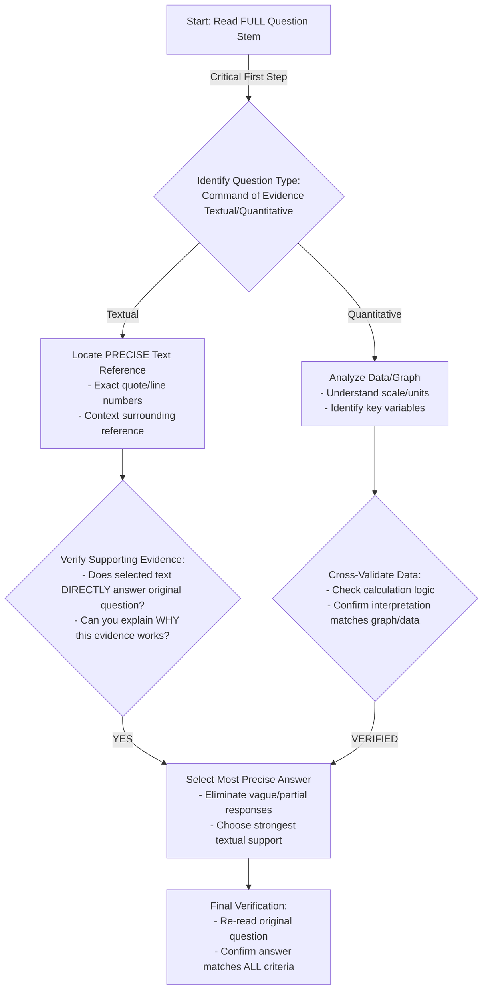
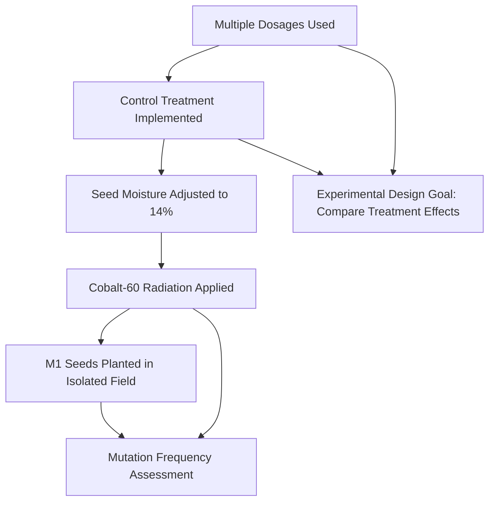

# SAT Reading Tutorial: Command of Evidence (Textual, Quantitative)

# Introduction

Here's a draft introduction:

Command of Evidence questions in SAT Reading aren't just another test hurdle—they're your strategic opportunity to demonstrate precise analytical thinking, especially within Natural Sciences passages. These questions challenge you to do more than simply understand text; they require you to pinpoint exactly how and why you've reached a specific interpretation.

Typically, you'll encounter stems like "Which quote most strongly supports the previous answer?" or "Which data point best illustrates the researcher's central claim?" In Natural Sciences—particularly Life Sciences—these questions test your ability to trace scientific reasoning from evidence to conclusion. A biology passage might describe cellular mutation and then ask you to select the precise textual reference that validates a specific claim about genetic processes.

Why are these questions crucial? They're essentially a two-step reasoning challenge that rewards careful, methodical reading. By requiring you to not just comprehend content, but to demonstrate the logical connections between evidence and interpretation, these questions mirror real scientific reasoning.

Imagine you're taking the exam and encounter a passage about evolutionary adaptation. Suddenly, a Command of Evidence question appears. Your heart might race—but here's a quick pro tip: Always return to the specific details in the text, tracing the logical pathway between claim and supporting information.

The key is staying calm, systematic, and confident. These questions aren't designed to trick you, but to assess your ability to think like a careful, precise scientific reader. By understanding their structure and practicing strategic approaches, you'll transform what seems challenging into an opportunity to showcase your analytical skills.

# General Strategy

Key Design Principles:
- Emphasizes systematic verification
- Distinguishes between Textual/Quantitative approaches
- Builds in critical thinking checkpoints
- Focuses on precision over speed

Would you like me to elaborate on any specific node or decision point in the strategy?

# Practice

## Let's Practice

Here's a typical SAT Reading Natural Sciences passage that tests Command of Evidence (Textual, Quantitative) skills:

The use of five dosages increased the chance of finding one dosage that would result in an adequate mutation frequency. The use of a control treatment made it possible to assess how each of the dosages influenced germination and the frequency of mutation. Before treatment, the seeds were brought to 14% moisture. Adjustment of moisture would be considered a pretreatment. It is assumed that the breeder had some prior knowledge that this step would be useful when using cobalt-60 radiation. The M1 seeds were planted in the field. Although rice is self-pollinated, the M1 plants were isolated by 11 m from untreated rice genotypes to prevent outcrossing. ________

Now, try this question:

Which quotation from the passage best supports the idea that the experiment was designed to compare different treatment effects?

Consider these options:
A) "The use of five dosages increased the chance of finding one dosage that would result in an adequate mutation frequency."
B) "Before treatment, the seeds were brought to 14% moisture."
C) "The M1 seeds were planted in the field."
D) "Although rice is self-pollinated, the M1 plants were isolated by 11 m from untreated rice genotypes"

Take a moment to think about your approach before reading the solution.

# Understanding the Passage

SAT Reading Natural Sciences Passage Analysis Guide

Active Reading Approach:
1. Annotation Strategy:
- Underline key scientific terminology (e.g., "mutation frequency", "cobalt-60 radiation")
- Circle numerical data and measurements (14% moisture, 11 m isolation)
- Mark methodological steps with brackets
- Note researcher's implied assumptions

Key Passage Characteristics:
- Technical, objective scientific writing style
- Experimental methodology description
- Precise quantitative details
- Implicit scientific reasoning

Critical Analytical Insights:

Main Scientific Context:
This passage describes a plant breeding experiment involving radiation-induced mutation in rice seeds. The researcher is systematically exploring genetic modification techniques through controlled radiation exposure.

Specific SAT-Tested Concept Examples:
1. Experimental Design Evidence (Lines 1-3):
- Multiple dosage approach demonstrates scientific rigor
- Control treatment allows comparative analysis
- Quote: "five dosages increased the chance of finding one dosage that would result in an adequate mutation frequency"

2. Methodological Precision (Lines 4-7):
- Precise moisture adjustment (14%)
- Deliberate isolation technique (11m separation)
- Demonstrates understanding of experimental variables

Purpose and Main Idea:
- Describe a controlled scientific mutation experiment
- Illustrate systematic approach to genetic modification
- Showcase experimental design principles

Question Preparation Strategies:
- Identify explicit methodological steps
- Recognize implicit scientific reasoning
- Connect quantitative details to experimental goals

Key Takeaway: Systematic observation, precise measurement, and controlled variables are fundamental to scientific research methodology.

Recommended Student Approach:
1. Read actively with scientific curiosity
2. Mark key methodological steps
3. Identify numerical/quantitative details
4. Understand implicit experimental reasoning
5. Connect specific techniques to broader scientific objectives

This analytical framework helps students deconstruct complex scientific passages by focusing on structure, methodology, and underlying scientific reasoning.

# Visual Analysis

# Step-by-Step Solution

Solution Walkthrough:

1. Rephrasing the Question:
Clarify: "Which quote provides the strongest evidence that the experiment was designed to systematically compare different treatment effects?"

2. Evidence Location Strategy:
- Focus on methodological language indicating comparative design
- Look for phrases suggesting intentional variation and controlled comparison

Key Evidence Quote: "The use of five dosages increased the chance of finding one dosage that would result in an adequate mutation frequency. The use of a control treatment made it possible to assess how each of the dosages influenced germination and the frequency of mutation."

3. Elimination Process:
- Choice B (moisture adjustment): Preparatory step, not comparative design
- Choice C (field planting): Describes location, not experimental comparison
- Choice D (isolation): Prevents genetic contamination, not treatment comparison
- Choice A: Directly describes using multiple dosages to systematically explore mutation frequencies

Trap Avoidance:
- Reject answers describing procedural details
- Prioritize quotes explicitly discussing experimental design and comparison

4. Matching Passage and Standards:
Choice A demonstrates:
- Intentional variation of dosages
- Systematic approach to finding optimal mutation conditions
- Explicit statement of experimental design goal

Aligns with SAT reading standards by:
- Identifying precise textual evidence
- Connecting quote to experimental methodology
- Showing analytical comprehension of scientific reasoning

5. Time-Pressure Strategies:
- Quickly scan for methodological language
- Look for phrases like "increased chance," "control treatment," "assess"
- Prioritize quotes describing experimental design, not just procedural steps
- Practice identifying comparative design markers in scientific texts

Correct Answer: A

Reflection: This approach transforms close reading into a structured, strategic process by focusing on methodological language and experimental design indicators.

Key Takeaway: In scientific passages, look for quotes that explicitly discuss how the experiment was designed to compare or systematically explore different conditions.

# Key Strategies

SAT Reading: Command of Evidence Strategies for Natural Sciences Passages

Reading Techniques:
For Natural Sciences passages, adopt a strategic reading approach that prioritizes:
- Identifying core scientific arguments
- Tracking experimental methodology descriptions
- Recognizing data interpretation patterns
- Noting cause-and-effect relationships
- Highlighting quantitative evidence and statistical claims

Key Evidence Spotting Strategies:
- Underline topic sentences and concluding statements
- Circle numerical data, percentages, and comparative language
- Mark transitions between hypothesis, methodology, and results
- Create quick margin annotations tracking argument progression
- Reference line numbers immediately when answering questions

Common SAT Command of Evidence Traps:
- Mismatched evidence citations
- Subtle language shifts in supporting statements
- Deliberately misleading statistical representations
- Evidence that sounds plausible but doesn't precisely match the original text
- Quantitative claims that seem related but lack direct textual support

Time Management Approach:
- Allocate 12-13 minutes per passage
- First pass: 3-4 minutes reading and annotating
- Second pass: 5-6 minutes answering questions
- Final 2-3 minutes reviewing and cross-checking evidence

Performance Improvement Steps:
- Practice with official College Board Natural Sciences passages
- Develop systematic annotation techniques
- Learn to quickly distinguish primary from secondary evidence
- Master skimming techniques for scientific texts
- Regularly practice timed, focused reading comprehension

Critical Practice Recommendation:
Complete 2-3 timed Natural Sciences passages weekly, focusing specifically on evidence selection and verification skills. Analyze mistakes systematically, tracking patterns in your error types.

By implementing these targeted strategies, students can significantly enhance their Command of Evidence performance in SAT Reading's scientific passages.

# Moving Forward

Here's a concise conclusion for Command of Evidence questions in Natural Sciences passages:

Mastering Command of Evidence questions requires a disciplined, evidence-driven approach. The key is always returning to the text, carefully tracing claims to their precise textual or quantitative sources, and resisting the temptation to rely on prior knowledge or intuition. When practicing, focus on developing a systematic method: first, thoroughly understand the passage's core argument, then methodically track how specific evidence supports or challenges that argument.

The most common pitfall is selecting an answer that seems plausible but lacks direct textual support. Always demand clear, explicit connections between the passage and your chosen response. Remember, these questions aren't about what you think might be true, but what the text definitively demonstrates.

By consistently practicing this evidence-centered reading strategy, you'll not only improve your test performance but also develop critical analytical skills that extend far beyond standardized testing. Stay patient, stay precise, and trust the evidence.

## Time Management Guidelines
- Reading Time: 2 minutes
- Solving Time: 2 minutes

## Expert Tip 
Locate explicit textual or quantitative evidence that validates your chosen answer.