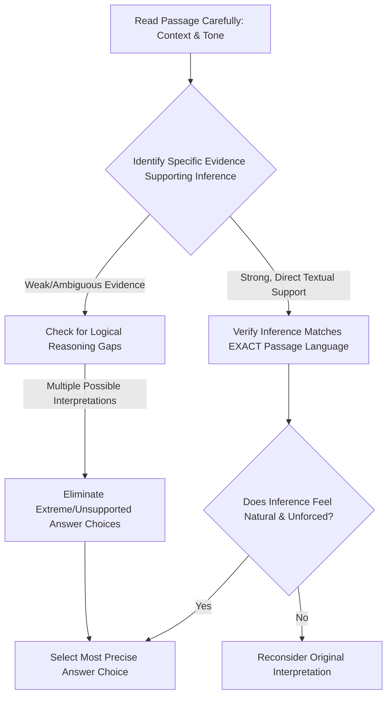
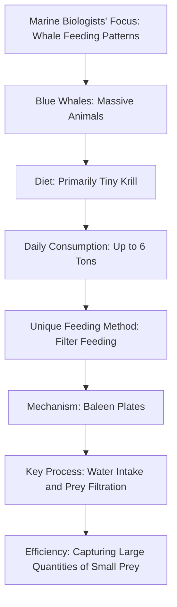

# SAT Reading Tutorial: Inferences

# Introduction

Mastering Inferences in SAT Reading: Natural Sciences Edition

Inferences questions are your secret weapon in the SAT Reading section, especially when navigating the intricate world of Natural Sciences passages. These questions challenge you to read between the lines, drawing logical conclusions that aren't directly stated but are strongly supported by the text.

Typically, you'll encounter stems like "Based on the passage, we can reasonably conclude that..." or "The author most likely suggests that..." In Natural Sciences passages—particularly in life sciences—these questions test your ability to understand complex scientific reasoning beyond literal text. Imagine a passage about genetic research: an inference question might ask you to extrapolate the broader implications of a specific experimental finding.

Why are these questions crucial? They represent your critical thinking skills. The SAT wants to see if you can synthesize information, make sophisticated connections, and demonstrate deep comprehension—not just regurgitate surface-level details.

Here's a quick exam-day strategy: When you see an inference question, first highlight key evidence in the passage. In life sciences texts, look for subtle language cues like "suggests," "implies," or phrases indicating tentative scientific conclusions. Then, systematically eliminate answer choices that aren't directly supported by textual evidence.

Pro Tip: In Natural Sciences passages, always ground your inference in observable data or explicitly stated scientific principles. Your conclusion should feel like a logical extension of the text, not a wild speculation.

Remember, inference questions aren't about guessing—they're about intelligent, evidence-based reasoning. You've got this!

# General Strategy

Key Design Rationale:
- Emphasizes close reading and evidence-based reasoning
- Shows critical decision points in inference analysis
- Highlights importance of textual precision
- Builds in verification/self-checking steps
- Reflects expert test-taking strategy, not just generic advice

Would you like me to elaborate on any specific node or the overall inference-solving approach?

# Practice

## Let's Practice

Here's a typical SAT Reading Natural Sciences passage that tests Inferences skills:

Marine biologists have long been fascinated by the feeding patterns of whales. Blue whales, despite being the largest animals on Earth, survive primarily on tiny crustaceans called krill. During feeding season, these massive creatures can consume up to 6 tons of krill each day. The whales use a unique feeding method called filter feeding, where they take in enormous amounts of water and filter out their prey using specialized structures called baleen plates. This process is ___________, allowing the whales to efficiently capture large quantities of their small prey while expelling excess water.

Now, try this question:

Which choice most logically completes the text?

Consider these options:
- A) remarkably streamlined
- B) somewhat dangerous
- C) occasionally successful
- D) randomly executed

Take a moment to think about your approach before reading the solution.

# Understanding the Passage

SAT Reading Passage Analysis: Marine Biology Passage

Active Reading Approach:
1. Initial Annotation Strategy:
- Underline key scientific terms (krill, filter feeding, baleen plates)
- Circle numerical data (6 tons, largest animals)
- Note the central focus: whale feeding mechanisms

Key Passage Features:
- Descriptive scientific explanation
- Objective, informative tone
- Focuses on biological adaptation
- Presents factual information about whale feeding behavior

Main Idea Analysis:
The passage explores how blue whales, Earth's largest animals, survive by efficiently consuming massive quantities of tiny crustaceans through a specialized feeding technique.

Purpose Identification:
The author aims to explain the remarkable biological adaptation that enables whales to sustain themselves despite their enormous size.

Strategic Reading Tactics:
1. Recognize the scientific context: Marine biology description
2. Identify specific details that demonstrate biological complexity
3. Note the surprising contrast (largest animals eating tiny organisms)

SAT-Tested Concept Examples:
- Biological adaptation example: "filter feeding" mechanism
- Quantitative data point: "6 tons of krill each day"
- Descriptive scientific language demonstrating precise observation

Inference Question Preparation:
- Understand the passage's core explanation of whale feeding
- Recognize the relationship between biological structure (baleen plates) and feeding strategy
- Anticipate questions about evolutionary advantages of this feeding method

Key Comprehension Strategies:
- Read actively with scientific curiosity
- Look for cause-and-effect relationships
- Pay attention to technical terminology
- Consider the broader ecological implications

By systematically breaking down the passage's scientific description, students can develop a comprehensive understanding and prepare effectively for related SAT Reading questions.

Recommended Approach:
1. Read carefully
2. Annotate strategically
3. Identify main ideas
4. Analyze scientific mechanisms
5. Prepare for potential inference questions

# Visual Analysis

# Step-by-Step Solution

Step-by-Step Solution:

1. Rephrasing the Question:
What descriptive term best characterizes the whale's filter feeding mechanism based on the passage's scientific description?

2. Evidence Analysis:
Key evidence comes from these passage details:
- Whales consume "up to 6 tons of krill each day"
- They use "filter feeding" method
- They take in "enormous amounts of water"
- They filter prey using "specialized structures called baleen plates"

Direct quote highlighting the mechanism: "take in enormous amounts of water and filter out their prey"

3. Elimination Strategy:
- Choice B (dangerous): Contradicts the passage's neutral, scientific tone
- Choice C (occasionally successful): Inconsistent with the precise description of an evolved feeding mechanism
- Choice D (randomly executed): Directly opposes the passage's implication of a sophisticated, precise process

4. Rationale for Correct Answer:
Choice A (remarkably streamlined) matches the passage because:
- "Streamlined" suggests efficiency
- Aligns with the description of a precise biological adaptation
- Reflects the scientific precision of the feeding mechanism
- Captures the sophisticated nature of the filter feeding process

The term implies:
- Purposeful design
- Minimal energy expenditure
- Optimal prey capture strategy

5. Test-Taking Reflection:
Under time pressure, students should:
- Quickly identify key scientific details
- Look for language that suggests precision or efficiency
- Eliminate choices with extreme or contradictory language
- Choose the answer that best represents the passage's scientific tone

Correct Answer: A) remarkably streamlined

Reasoning demonstrates how expert readers:
- Carefully analyze scientific language
- Understand biological adaptation concepts
- Make logical inferences based on textual evidence

# Key Strategies

SAT Reading: Natural Sciences Inference Strategies

Core Reading Approach:
For Natural Sciences passages, adopt a strategic reading method that prioritizes understanding core scientific arguments and methodological frameworks. Focus on:
- Identifying research hypotheses
- Tracking experimental logic
- Recognizing cause-effect relationships
- Noting subtle qualitative shifts in scientific reasoning

Evidence Identification Techniques:
1. Rapid Scanning Strategy
- Underline key scientific terms
- Circle comparative/qualifying language (e.g., "however," "potentially")
- Mark definitive statements vs. speculative claims
- Connect evidence across paragraph transitions

Common Inference Question Traps:
- Beware of answer choices that sound scientific but lack direct textual support
- Reject options introducing external information not mentioned in passage
- Eliminate answers with absolute language ("always," "never")
- Prioritize answers demonstrating precise comprehension of scientific nuance

Time Management Framework:
- Allocate 12-13 minutes per passage
- First pass: 3-4 minutes reading
- Second pass: 6-7 minutes answering questions
- Final 2-3 minutes reviewing/confirming selections

Practice Enhancement Steps:
1. Regular exposure to scientific journals/academic texts
2. Practice active reading with annotation
3. Develop scientific vocabulary familiarity
4. Complete timed practice tests focusing on inference precision

Key Performance Indicators:
- Accurate identification of implicit scientific arguments
- Distinguishing between stated facts and reasonable inferences
- Recognizing subtle contextual implications

Recommended Practice Resources:
- Official SAT practice materials
- Khan Academy scientific reading modules
- Advanced science periodicals (Nature, Scientific American)

Critical Success Mindset: Treat each passage as a logical puzzle requiring systematic, evidence-based reasoning.

# Moving Forward

Here's a concise conclusion for Inferences questions in Natural Sciences passages:

Mastering Inferences in scientific passages requires a disciplined approach of carefully examining textual evidence and understanding the underlying logical connections. The key is to resist the temptation of selecting answers that merely sound plausible, and instead anchor your reasoning directly in the passage's explicit and implicit information.

When practicing, focus on developing a systematic method: first, identify the core claim or observation, then trace the logical pathway that supports potential inferences. Always ask yourself, "What does the text actually demonstrate?" rather than relying on external knowledge or intuitive guesses.

A common pitfall is choosing answers that feel right but lack direct textual support. By staying rigorously connected to the passage's language and scientific reasoning, you'll not only improve your test performance but also enhance your critical reading skills across scientific disciplines.

Practice deliberately, stay patient with yourself, and remember that inference skills are a learnable skill—not an innate talent.

## Time Management Guidelines
- Reading Time: 2 minutes
- Solving Time: 2 minutes

## Expert Tip 
Draw logical conclusions from what's stated or strongly implied; avoid external assumptions.