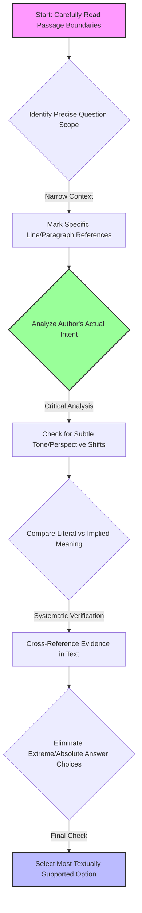
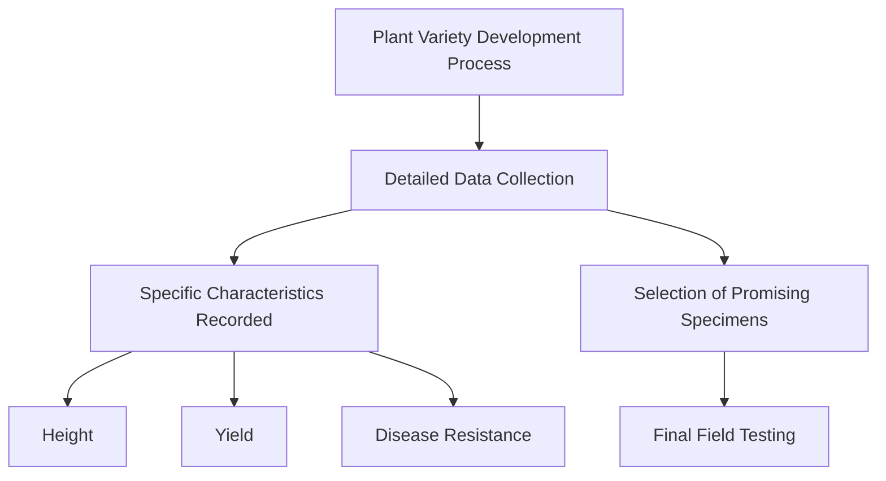

# SAT Reading Tutorial: Boundaries

# Introduction

Mastering Boundaries Questions in SAT Reading: Natural Sciences Edition

Boundaries questions are your strategic gateway to precision in the SAT Reading section, especially within Natural Sciences passages. These questions test your ability to pinpoint exactly where an author's argument shifts, where evidence begins or ends, and how scientific claims are delimited—skills that are critical in disciplines like biology, ecology, and medical research.

Typical question stems will prompt you to identify precise textual moments: "Where does the author transition from discussing X to explaining Y?" or "Which sentence marks the boundary between the researcher's observation and interpretation?" In Life Sciences passages, these often revolve around methodological transitions, hypothesis development, or the limits of scientific claims.

Why are these questions so crucial? They demand close reading and analytical precision. By consistently nailing Boundaries questions, you demonstrate to the College Board that you don't just passively read text—you actively map its intellectual terrain.

Imagine you're taking the SAT, and a passage about genetic mutations suddenly shifts from describing a phenomenon to analyzing its implications. A Boundaries question will ask you to identify that exact pivot point. Your quick tip? Always track the logical "signposts" in scientific writing—words like "however," "consequently," or "in contrast" that signal conceptual transitions.

Pro strategy: Treat these questions like a scientific detective would—look for the moment when the narrative or argumentative lens subtly but definitively changes. Your precision here can be the difference between a good and exceptional SAT Reading score.

# General Strategy

Key Design Rationale:
- Emphasizes systematic, evidence-based approach
- Highlights critical thinking over mechanical reading
- Shows decision points that prevent common mistakes
- Focuses on textual precision and nuanced interpretation

Would you like me to elaborate on any specific node or decision point in the strategy?

# Practice

## Let's Practice

Here's a typical SAT Reading Natural Sciences passage that tests Boundaries skills:

The development of new plant varieties requires careful attention to detail and precise documentation. _ researchers must record data about plant characteristics, including height, yield, and disease resistance. These observations help breeders identify promising specimens for future cultivation. After collecting this information, scientists can begin the selection process, choosing only the healthiest and most productive plants for continued study. The final step involves extensive field testing to ensure the new variety performs well under various growing conditions.

Now, try this question:

Which choice completes the text so that it conforms to the conventions of Standard English?

Consider these options:
- A) At any given moment
- B) At any given moment,
- C) At any given moment;
- D) At any given moment:

Take a moment to think about your approach before reading the solution.

# Understanding the Passage

SAT Reading Strategy: Analyzing a Natural Sciences Passage on Plant Breeding

Active Reading Approach:
When approaching this passage, use these critical annotation techniques:
- Underline key scientific processes (e.g., "selection process")
- Circle technical vocabulary
- Mark structural shifts in the research methodology
- Note the logical progression of scientific investigation

Key Textual Features:
1. Objective, precise language typical of scientific writing
2. Procedural description of research methodology
3. Focus on systematic, step-by-step investigation
4. Emphasis on empirical observation and data collection

Critical Analysis Breakdown:

Main Idea: The passage describes the systematic process of developing new plant varieties through careful scientific research and selection.

Specific SAT-Tested Concepts:

1. Research Methodology Example:
Quote: "researchers must record data about plant characteristics, including height, yield, and disease resistance"
- Highlights scientific precision
- Demonstrates quantitative observation techniques

2. Selection Process Example:
Quote: "choosing only the healthiest and most productive plants for continued study"
- Illustrates scientific criteria for evaluation
- Shows how researchers make evidence-based decisions

Purpose and Boundaries Question Strategy:
The author's purpose is to explain the technical process of plant variety development. For Boundaries questions, focus on:
- Identifying the core scientific procedure
- Recognizing the logical sequence of research steps
- Understanding the systematic approach to scientific investigation

Key Reading Tactics:
- Read actively and critically
- Identify structural progression
- Look for precise scientific language
- Understand the underlying research methodology

Pro Tip: Always connect the specific details to the broader scientific process. In this case, the passage demonstrates how careful observation and selection lead to improved plant varieties.

Practice Recommendation:
- Practice annotating scientific passages
- Break down complex procedures into clear steps
- Look for the underlying scientific logic

By applying these strategies, students can confidently approach Natural Sciences passages on the SAT Reading section, transforming complex scientific text into clear, comprehensible information.

# Visual Analysis

# Step-by-Step Solution

Step-by-Step Solution for Boundaries Question:

1. Rephrasing the Question:
"Which punctuation and phrasing best connects the introductory phrase to the main clause while maintaining grammatical clarity?"

2. Evidence Analysis:
- Key Context: Scientific documentation requires precise language
- Structural Clue: The sentence needs a smooth transition between the introductory phrase and the main subject
- Direct Quote: "_ researchers must record data about plant characteristics"

3. Elimination Strategy:
- Eliminate choices that create grammatical disruption
- Rule out options that break sentence flow
- Check for punctuation that supports natural reading rhythm

Elimination Process:
- A) "At any given moment" - Lacks punctuation, creates awkward connection
- B) "At any given moment," - Provides correct comma placement
- C) "At any given moment;" - Semicolon is too strong, disrupts flow
- D) "At any given moment:" - Colon suggests a list or explanation follows, inappropriate here

4. Correct Choice Rationale:
Choice B wins because:
- Comma creates a natural pause
- Maintains grammatical standard
- Supports scientific writing's clarity
- Connects introductory phrase smoothly to main clause

5. Test-Taking Reflection:
Quick Technique:
- Read aloud each option
- Listen for natural speech rhythm
- Check punctuation's logical function
- Prioritize clarity and connection

Correct Answer: B) At any given moment,

Key Takeaway: In scientific writing, punctuation serves precise communication, not just grammatical rules.

# Key Strategies

SAT Reading: Natural Sciences Boundaries Strategy Guide

Core Reading Approach:
For Natural Sciences passages, adopt a strategic scanning method that prioritizes:
- Identifying core research claims
- Tracking methodological transitions
- Recognizing experimental scope limitations

Key Techniques:
1. Active Reading Framework
- Underline key methodological terms
- Mark boundary/limitation indicators (e.g., "however", "limited to", "suggests")
- Create quick margin annotations about experimental constraints

2. Evidence Detection Strategies
- Look for phrases like "this study demonstrates" or "within these parameters"
- Pay attention to researcher's explicit acknowledgment of research boundaries
- Note statistical qualifiers (p-values, confidence intervals)

Common Boundary Question Traps:
- Overgeneralized claims beyond research scope
- Misinterpreting correlation as causation
- Extrapolating limited sample findings

Time Management:
- Allocate 12-13 minutes per passage
- First 2-3 minutes: Active reading/annotation
- 4-5 minutes: Answer primary questions
- Final 3-4 minutes: Verify boundary/limitation questions

Practice Optimization:
- Use official College Board practice materials
- Focus on life sciences/experimental design passages
- Practice identifying subtle scope limitations
- Develop rapid pattern recognition for methodological constraints

Critical Boundary Markers:
- Sample size limitations
- Geographic/demographic restrictions
- Technological/measurement constraints
- Potential confounding variables

Recommended Study Protocol:
- Weekly timed practice passages
- Systematic error analysis
- Build vocabulary around scientific methodology
- Develop quick pattern recognition skills

By integrating these strategies, students can systematically improve their performance on Natural Sciences Boundaries questions, transforming potential confusion into confident, precise responses.

# Moving Forward

Here's a concise conclusion for Boundaries questions in Natural Sciences passages:

Mastering Boundaries questions ultimately requires disciplined evidence tracking and a precise analytical mindset. The key is to remain rigorously connected to the text, systematically evaluating each claim against the passage's explicit statements and logical framework. When practicing, focus on developing a habit of constant cross-referencing—match every potential answer choice directly back to the source material.

A common pitfall is selecting answers that feel intuitively correct but lack direct textual support. Always prioritize what the passage actually states over your preexisting assumptions or scientific background knowledge. Remember that these questions test your comprehension and close reading skills, not just your subject expertise.

By approaching Boundaries methodically and maintaining unwavering textual fidelity, you'll not only improve your test performance but also cultivate critical analytical skills that extend far beyond standardized testing. Stay focused, trust the evidence, and success will follow.

## Time Management Guidelines
- Reading Time: 1 minutes
- Solving Time: 1 minutes

## Expert Tip 
Observe where one argument ends and another begins, noting shift words or phrases.