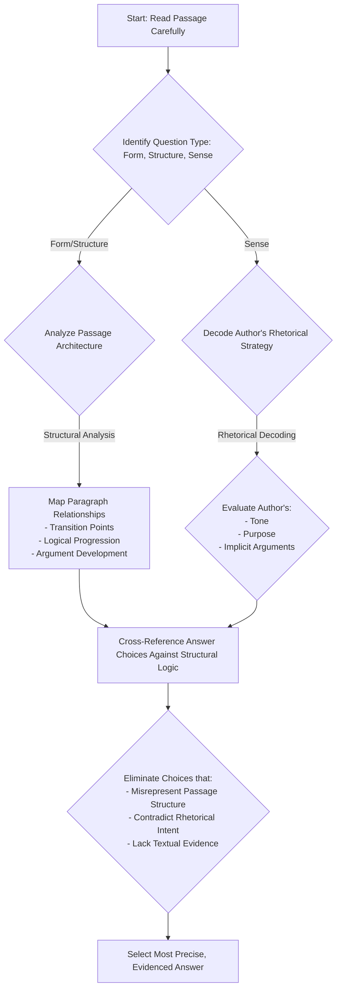
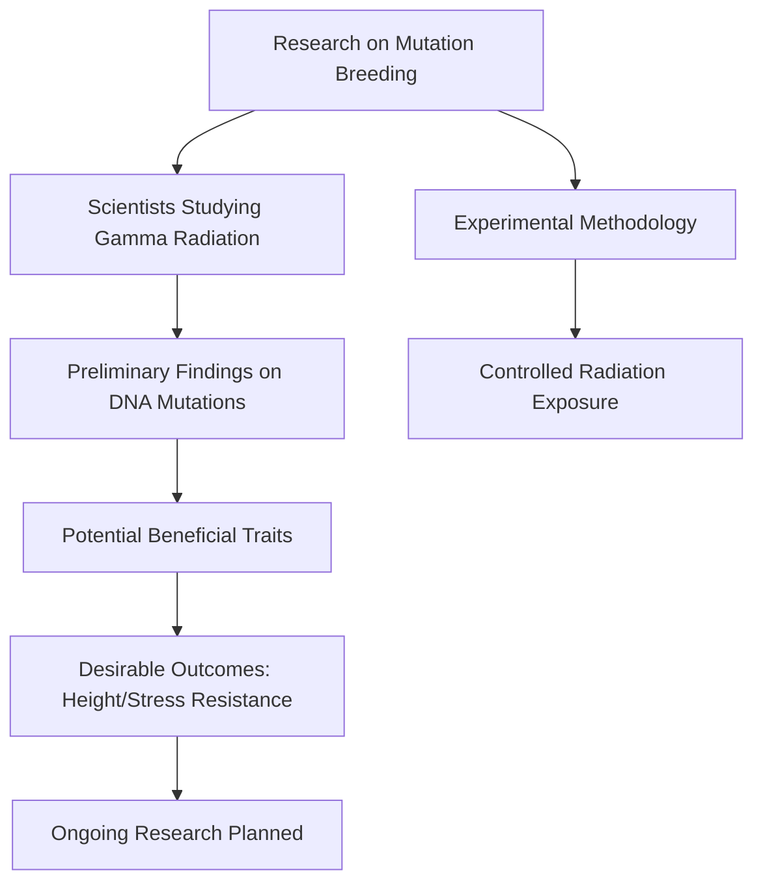

# SAT Reading Tutorial: Form, Structure, and Sense

# Introduction

Here's a draft introduction:

Mastering Form, Structure, and Sense Questions in SAT Reading: Your Natural Sciences Strategy Guide

When you're facing Natural Sciences passages on the SAT Reading section, Form, Structure, and Sense questions are your opportunity to demonstrate precise comprehension and analytical thinking. These questions—typically phrased as "The structure of the passage suggests..." or "The author's primary method of developing the argument is..."—test your ability to understand not just what a scientific text says, but how it communicates its ideas.

Why do these questions matter? They're your chance to showcase sophisticated reading skills beyond simple fact retrieval. In Life Sciences passages especially, authors use complex organizational strategies to explain intricate biological processes, evolutionary mechanisms, or research methodologies. Understanding these structural nuances can be the difference between a good and an exceptional score.

Imagine you're mid-exam, and you encounter a passage about cellular communication. A typical Form, Structure, and Sense question might ask how the author transitions between discussing molecular interactions and broader systemic implications. Your goal is to quickly map the passage's logical progression, identifying key rhetorical moves.

Quick Tip: Always look for signpost words like "however," "consequently," and "in contrast" that reveal an author's structural approach. These linguistic markers are your roadmap to understanding the passage's underlying architecture.

The key is developing a systematic approach—recognizing patterns, tracking rhetorical strategies, and understanding how scientific writers construct their arguments. With practice, you'll transform these potentially challenging questions into reliable score-boosters.

Ready to dive deeper? Let's break down exactly how to tackle these questions strategically and confidently.

# General Strategy

Key Design Principles:
- Systematic approach
- Critical thinking flow
- Evidence-based selection
- Structural awareness

Would you like me to elaborate on any specific node or decision point?

# Practice

## Let's Practice

Here's a typical SAT Reading Natural Sciences passage that tests Form, Structure, and Sense skills:

Research on mutation breeding has shown promising results in various plant species. A team of scientists _____ currently studying the effects of gamma radiation on different varieties of grass species. Their preliminary findings suggest that controlled exposure to radiation can produce beneficial mutations in plant DNA. These mutations sometimes lead to desirable traits such as shorter plant height or increased resistance to environmental stress. The research team plans to continue their experiments throughout the next growing season.

Now, try this question:

Which choice best completes the sentence while maintaining standard English grammar?

Consider these options:
- A) are
- B) is
- C) were
- D) being

Take a moment to think about your approach before reading the solution.

# Understanding the Passage

SAT Reading Natural Sciences Passage Analysis Guide

Active Reading Approach:
1. Initial Scan: Identify the passage's core focus - mutation breeding in plant species
2. Annotation Strategies:
  - Underline key scientific terms (gamma radiation, mutations, DNA)
  - Circle main claims about radiation's effects
  - Mark the research team's methodology and objectives

Key Textual Features:
- Technical vocabulary specific to genetics/plant biology
- Objective, neutral scientific tone
- Clear research progression (current study → preliminary findings → future plans)
- Empirical observation-based narrative

SAT-Tested Concept Examples:
1. Scientific Methodology Concept:
  - Quote: "controlled exposure to radiation can produce beneficial mutations"
  - Demonstrates experimental design and hypothesis testing
  - Shows scientific method's systematic approach

2. Cause-and-Effect Relationship:
  - Line reference: Mutations "lead to desirable traits"
  - Highlights scientific reasoning about genetic modifications
  - Illustrates how researchers interpret experimental outcomes

Main Idea and Purpose Analysis:
- Main Idea: Exploring radiation's potential for intentional genetic modification in plants
- Author's Purpose: Presenting preliminary research findings about mutation breeding
- Approach: Neutral, informative scientific reporting

Question Preparation Strategy:
- Identify central claims about radiation's genetic effects
- Track the research team's methodology
- Understand the scientific reasoning behind mutation breeding

Key Reading Tactics:
- Read actively, not passively
- Look for cause-effect relationships
- Note scientific terminology
- Understand the research progression
- Recognize the objective tone

By applying these strategies, students can confidently navigate complex scientific passages, breaking down technical information into comprehensible components and preparing for various SAT Reading question types.

# Visual Analysis

# Step-by-Step Solution

Step-by-Step Solution for Form, Structure, and Sense Question

1. Rephrasing the Question:
Which verb form correctly completes the sentence while maintaining grammatical clarity and matching the passage's scientific context?

2. Evidence Analysis:
Key contextual clues:
- Present tense context: "currently studying"
- Ongoing research: "plans to continue their experiments"
- Scientific writing typically uses present tense for current research

Direct textual evidence supports present progressive tense, indicating an ongoing action.

3. Eliminating Trap Choices:
- A) "are" - Matches subject-verb agreement and present progressive tense ✓
- B) "is" - Grammatically incorrect (doesn't match plural subject "team") ✗
- C) "were" - Past tense, contradicts "currently" ✗
- D) "being" - Incomplete verb construction ✗

4. Rationale for Correct Choice:
Choice A ("are") meets multiple criteria:
- Grammatically correct
- Matches plural subject ("team of scientists")
- Reflects ongoing research action
- Aligns with scientific writing conventions of present tense reporting

5. Test-Taking Strategy:
Quick elimination process:
- Identify subject ("team of scientists" - plural)
- Check verb tense context
- Match grammatical agreement
- Verify logical scientific communication style

Expert Reasoning Reflection:
- Read carefully
- Identify grammatical subject
- Match verb to subject
- Consider contextual scientific communication norms

Correct Answer: A) are

Key Takeaway: Systematic analysis trumps guessing. Break down grammar, context, and scientific communication principles systematically.

Recommended Time: 45-60 seconds per question

# Key Strategies

SAT Reading Strategies for Natural Sciences Passages: Form, Structure, and Sense Mastery

Reading Techniques:
For Natural Sciences passages, adopt a strategic reading approach that prioritizes:
- Identifying central research hypotheses
- Tracking experimental methodology descriptions
- Recognizing cause-and-effect relationships
- Noting shifts between observational data and scientific interpretation

Evidence Spotting Strategies:
1. Keyword Tracking
- Highlight scientific terminology
- Circle comparative/analytical language (e.g., "however," "consequently")
- Underline quantitative descriptors

2. Paragraph Summarization Technique
- Create 1-2 word marginal notes capturing each paragraph's core argument
- Link paragraphs' logical progression
- Quickly map passage's overall structural flow

Common SAT Traps:
- Overly complex answer choices with scientific jargon
- Answers that sound scientific but misrepresent passage content
- Choices that introduce external scientific information not in the original text
- Tempting but contextually incorrect interpretations

Time Management:
- Allocate 12-13 minutes per passage
- First pass: 3-4 minutes reading
- Second pass: 6-7 minutes answering questions
- Final 2-3 minutes reviewing/checking answers

Performance-Boosting Practice Steps:
1. Regular exposure to scientific journal-style texts
2. Practice active reading with scientific publications
3. Develop rapid annotation skills
4. Build scientific vocabulary comprehension
5. Complete timed practice tests focusing on Natural Sciences sections

Key Efficiency Tips:
- Read questions before detailed passage review
- Eliminate obviously incorrect answers quickly
- Use line references strategically
- Trust passage evidence over external knowledge

Recommended Practice Resources:
- College-level scientific publications
- SAT official practice materials
- Online scientific reading comprehension exercises

By systematically applying these strategies, students can significantly improve their performance on Natural Sciences Form, Structure, and Sense questions, transforming potential challenges into scoring opportunities.

# Moving Forward

Here's a concise conclusion for Form, Structure, and Sense in Natural Sciences passages:

Mastering Form, Structure, and Sense questions requires a disciplined, evidence-based approach. The key is always to ground your analysis in the text itself, carefully tracing how scientific authors construct arguments through precise language and logical connections. When practicing, focus on understanding the passage's underlying rhetorical strategy—how evidence is presented, how claims are supported, and how scientific reasoning unfolds.

A common pitfall is selecting answers that seem plausible but lack direct textual support. Always return to the passage, highlighting specific phrases and tracking the author's precise language. Remember that scientific writing demands rigorous interpretation, not casual inference.

By developing these close-reading skills, you'll not only improve your test performance but also cultivate a more analytical, nuanced approach to complex scientific texts. Stay patient, stay precise, and trust the process.

## Time Management Guidelines
- Reading Time: 1.5 minutes
- Solving Time: 1.5 minutes

## Expert Tip 
See how the format—paragraphing, sectioning, headings—contributes to meaning.