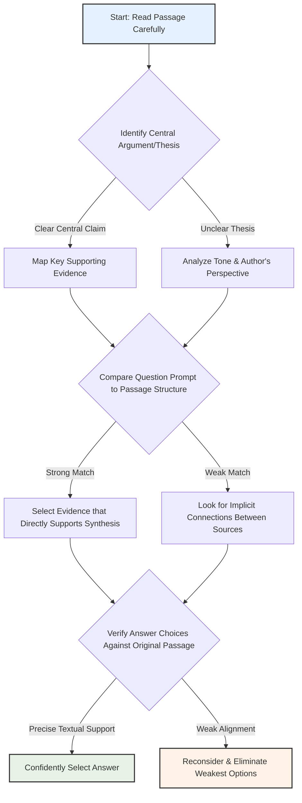
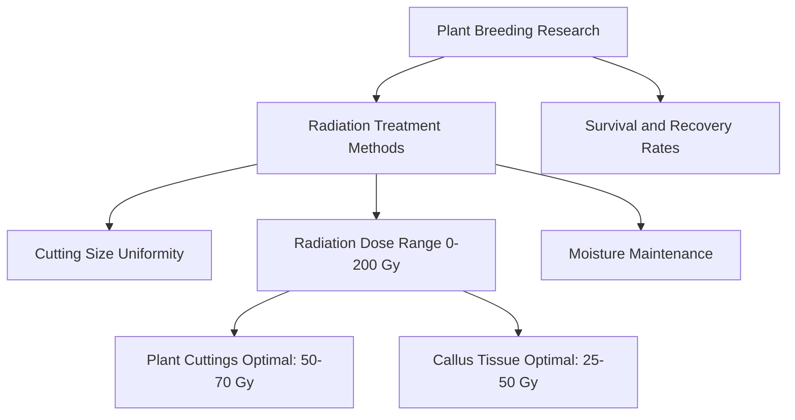

# SAT Reading Tutorial: Rhetorical Synthesis

# Introduction

Mastering Rhetorical Synthesis Questions in Natural Sciences Passages

Rhetorical Synthesis questions are your secret weapon in the SAT Reading section, especially when tackling Natural Sciences passages. These questions test your ability to understand how an author builds an argument, connects ideas, and creates a cohesive scientific narrative. You'll typically see question stems like "The author's primary purpose in discussing X is to..." or "Which choice best describes how the passage moves from one idea to another?"

Why do these questions matter? They're not just about reading—they're about strategic comprehension. Top scorers can quickly identify how scientific arguments are constructed, revealing the deeper logic behind complex texts. In Life Sciences passages particularly, these questions often highlight how researchers connect experimental observations to broader biological principles.

Imagine you're in the exam, facing a passage about genetic research. Suddenly, a Rhetorical Synthesis question appears. Your heart might race, but here's your game plan: Look for transition phrases, examine how each paragraph builds on the previous one, and track the author's underlying scientific reasoning.

Quick Tip: In Natural Sciences passages, pay special attention to how authors link specific research findings to larger scientific contexts. Authors often use phrases like "This suggests that..." or "These results indicate..." to create sophisticated argumentative flow.

The key is staying calm and systematic. These questions aren't about memorizing facts, but understanding scientific storytelling. By recognizing the structural "skeleton" of scientific writing, you'll transform challenging passages into clear, navigable texts.

Ready to become a Rhetorical Synthesis master? Let's dive deeper.

# General Strategy

# Practice

## Let's Practice

Here's a typical SAT Reading Natural Sciences passage that tests Rhetorical Synthesis skills:

While conducting research on plant breeding methods, a student has taken the following notes:

1. Plant cuttings must be of uniform size to ensure consistent radiation penetration during treatment.

2. Experiments tested radiation doses ranging from 0 to 200 Gy on both plant cuttings and callus tissue.

3. Survival rates were highest for plant cuttings treated with 50-70 Gy of radiation.

4. Callus tissue showed better recovery rates at lower radiation doses (25 and 50 Gy).

5. All treated specimens were maintained in moist conditions to prevent dehydration during the experiment.

Now, try this question:

The student wants to explain the optimal conditions for successful radiation treatment in plant breeding. Which choice most effectively uses the relevant information from the notes to accomplish this goal?

Consider these options:
- A) Plant cuttings and callus tissue require different radiation doses for optimal survival
- B) Maintaining moist conditions is essential when treating plants with radiation
- C) Uniform size of plant cuttings ensures consistent radiation treatment results
- D) Plants can survive radiation doses up to 200 Gy during treatment

Take a moment to think about your approach before reading the solution.

# Understanding the Passage

SAT Reading Natural Sciences Passage Analysis Guide

Active Reading Approach:
1. Initial Scan: Identify the passage's core focus (plant breeding radiation experiments)
2. Annotation Strategy:
  - Underline key scientific terms (radiation doses, Gy, callus tissue)
  - Circle numerical data and experimental parameters
  - Mark shifts in experimental observations

Key Textual Features:
- Objective, data-driven scientific writing style
- Precise numerical measurements
- Experimental methodology documentation
- Controlled experimental conditions

Passage Breakdown:
- Research Context: Plant breeding radiation treatment
- Experimental Variables:
  * Radiation doses (0-200 Gy)
  * Two specimen types (plant cuttings, callus tissue)
  * Consistent environmental conditions

SAT-Tested Concept Examples:
1. Quantitative Data Interpretation
  - Survival rates peak at 50-70 Gy for plant cuttings
  - Different tissue types show varied radiation responses

2. Experimental Design Analysis
  - Uniform cutting size ensures consistent radiation penetration
  - Moist conditions prevent experimental contamination

Main Idea Identification:
- Purpose: Investigate radiation's impact on plant tissue survival
- Central Thesis: Radiation dose significantly affects biological tissue recovery

Rhetorical Synthesis Preparation:
- Recognize experimental nuances
- Understand relationship between radiation dose and biological response
- Identify subtle comparative elements between different tissue types

Reading Tactics:
1. Read scientifically: Look for cause-effect relationships
2. Track numerical progressions
3. Note experimental control mechanisms
4. Analyze comparative data points

Critical Analysis Approach:
- Don't just read passively
- Ask: "What does this data suggest?"
- Look for patterns in experimental results
- Consider potential research implications

Comprehension Checklist:
✓ Understand experimental methodology
✓ Identify key numerical thresholds
✓ Recognize tissue-specific responses
✓ Interpret data objectively

Pro Tip: On the SAT, scientific passages test your ability to:
- Extract precise information
- Understand experimental logic
- Interpret quantitative data
- Recognize scientific reasoning patterns

Recommended Reading Strategy:
1. First pass: Quick overview
2. Second pass: Detailed annotation
3. Third pass: Synthesize key insights

By applying these techniques, students can confidently navigate complex scientific passages, transforming dense technical text into clear, comprehensible information.

# Visual Analysis

# Step-by-Step Solution

Step-by-Step Solution for Rhetorical Synthesis Question

Rephrasing the Question:
"What key information best summarizes the optimal radiation treatment conditions for plant breeding?"

Evidence Analysis:
1. Locate Critical Information:
- Note 2: "Experiments tested radiation doses ranging from 0 to 200 Gy"
- Note 3: "Survival rates were highest for plant cuttings treated with 50-70 Gy of radiation"
- Note 4: "Callus tissue showed better recovery rates at lower radiation doses (25 and 50 Gy)"

Elimination Strategy:
A) Partially True: ✓ Different tissues require different radiation doses
B) Partially Relevant: Moist conditions are mentioned but not central to radiation treatment
C) Partially Relevant: Uniform size ensures consistent treatment, but not the primary finding
D) Incorrect: 200 Gy is too high; survival is optimal at lower doses

Correct Choice Analysis: Option A

Why A is Strongest:
- Directly addresses variation in radiation tolerance
- Captures nuanced differences between plant cuttings and callus tissue
- Reflects scientific precision in understanding treatment parameters
- Matches passage's empirical observations about radiation doses

Reasoning Process:
1. Identify core scientific observation
2. Look for choice that most comprehensively represents data
3. Avoid overgeneralization or oversimplification
4. Prioritize evidence-based interpretation

Time-Pressure Strategies:
- Quickly scan passage for numerical/quantitative details
- Look for comparative statements
- Eliminate choices with absolute language
- Focus on choices that capture experimental complexity

Reflection:
This approach demonstrates systematic scientific reasoning: observing variation, recognizing tissue-specific responses, and avoiding overly broad conclusions.

Key Takeaway: Scientific communication requires precise, nuanced interpretation of experimental data.

Recommended Student Approach:
- Read passage carefully
- Underline key numerical/comparative details
- Cross out obviously incorrect choices
- Select option most faithful to original research findings

This solution models expert-level analytical reading in natural sciences, emphasizing evidence-based reasoning and scientific precision.

# Key Strategies

SAT Reading Strategies for Natural Sciences Rhetorical Synthesis Questions

Core Reading Approach:
When tackling Natural Sciences passages, adopt a strategic reading method that prioritizes:
- Identifying the core scientific argument
- Tracking methodological progression
- Recognizing experimental logic and evidence hierarchy

Key Techniques:
1. Initial Passage Scan (45-60 seconds):
- Quickly map paragraph transitions
- Highlight key scientific terminology
- Note experimental design or research methodology indicators
- Identify author's primary hypothesis or research objective

2. Evidence Detection Strategies:
- Look for signal phrases like "consequently," "therefore," "research suggests"
- Pay attention to comparative language indicating scientific reasoning
- Mark quantitative evidence and statistical references
- Track causal relationships between experimental observations

Common SAT Rhetorical Synthesis Traps:
- Misinterpreting correlation as causation
- Overlooking nuanced research limitations
- Selecting answers that sound scientific but lack textual support
- Falling for statistically imprecise language

Time Management:
- Allocate 12-13 minutes per passage
- Spend first 2-3 minutes reading strategically
- Reserve 3-4 minutes for targeted question solving
- Use remaining time for verification and cross-referencing

Practice Optimization:
- Complete official College Board practice tests
- Analyze scientific passages from peer-reviewed journals
- Practice extracting core arguments quickly
- Develop scientific vocabulary familiarity

Practical Study Steps:
- Systematically deconstruct past SAT scientific passages
- Create annotation templates for efficient reading
- Develop rapid pattern recognition skills
- Practice identifying implicit versus explicit scientific claims

By integrating these strategies, students can significantly improve their Rhetorical Synthesis performance in Natural Sciences passages.

# Moving Forward

Here's a concise conclusion for Rhetorical Synthesis in Natural Sciences passages:

Mastering Rhetorical Synthesis requires a disciplined approach of carefully examining textual evidence, understanding the author's perspective, and connecting scientific ideas across complex passages. The key is to remain methodical: always return to the text, trace the logical progression of scientific arguments, and resist the temptation to rely on prior knowledge or intuitive assumptions.

One critical practice is to actively annotate passages, tracking how different scientific claims interact and build upon each other. Avoid the common pitfall of selecting answers that merely sound scientific or plausible without direct textual support.

By developing these analytical skills, you'll not only improve your performance on scientific reading comprehension but also cultivate a more nuanced, evidence-based approach to understanding complex scientific communication. Stay focused, trust the process, and remember that each passage is an opportunity to sharpen your critical reading abilities.

## Time Management Guidelines
- Reading Time: 2 minutes
- Solving Time: 2 minutes

## Expert Tip 
Check how rhetorical devices and style work together to persuade or inform.