# SAT Reading Mastery Guide

This comprehensive guide covers all question types you'll encounter on the SAT Reading section, with detailed strategies and examples for each type.

## Table of Contents
- [Words in Context](#words-in-context)
- [Transitions](#transitions)
- [Text Structure and Purpose](#text-structure-and-purpose)
- [Cross-Text Connections](#cross-text-connections)
- [Central Ideas and Details](#central-ideas-and-details)
- [Command of Evidence (Textual, Quantitative)](#command-of-evidence-(textual,-quantitative))
- [Inferences](#inferences)
- [Boundaries](#boundaries)
- [Form, Structure, and Sense](#form,-structure,-and-sense)
- [Rhetorical Synthesis](#rhetorical-synthesis)

---

# SAT Reading Tutorial: Words in Context

# Introduction

Here's a draft introduction:

Mastering Words in Context questions can be your secret weapon in the SAT Reading section, especially when navigating Natural Sciences passages. These questions test your ability to understand how words function dynamically within complex scientific texts, challenging you to look beyond simple dictionary definitions.

Typically, you'll encounter stems like "As used in line X, the word 'Y' most nearly means..." or "The author uses 'Z' to primarily suggest..." In Natural Sciences passages—particularly in life sciences—these questions demand more than memorization; they require sophisticated comprehension of how scientific language conveys precise meaning.

Why are these questions crucial? They're not just about vocabulary, but about demonstrating your deep reading skills. In life sciences texts, words often carry nuanced technical or contextual significance that goes far beyond their everyday usage. A term like "adaptation" in an evolutionary biology passage, for instance, has a much more specific meaning than casual conversation might suggest.

Imagine you're mid-exam, facing a dense paragraph about cellular metabolism. You see a Words in Context question about the term "regulate." Your quick strategy? Look closely at the surrounding sentences. What's the broader scientific process being described? How does the word connect to the passage's core scientific explanation?

Pro tip for Natural Sciences passages: Always consider the technical context. Scientific language is precise—the word's meaning will be tightly linked to the specific biological, chemical, or physiological process being discussed.

By approaching these questions strategically, you'll not just decode vocabulary, but demonstrate sophisticated comprehension that impresses SAT scorers.

# General Strategy

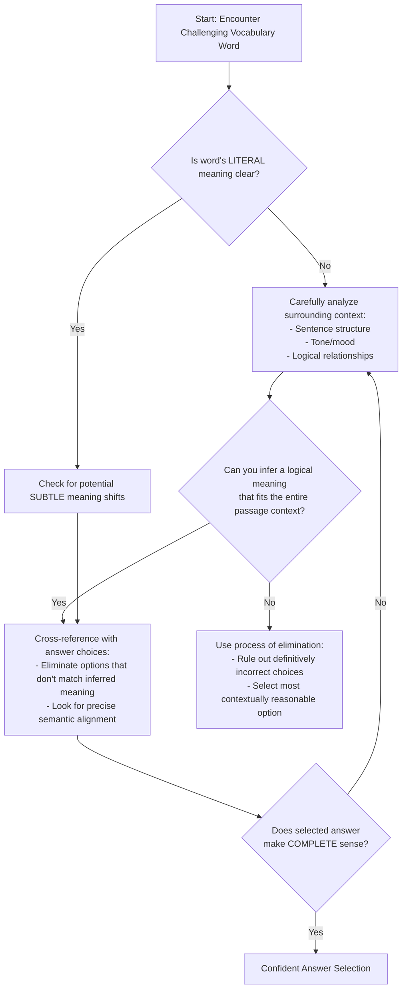

Key Design Principles:
- Emphasizes contextual reasoning
- Provides systematic approach
- Highlights critical thinking
- Prevents overthinking
- Creates clear decision paths

Would you like me to elaborate on any specific node or reasoning strategy?

# Practice

## Let's Practice

Here's a typical SAT Reading Natural Sciences passage that tests Words in Context skills:

Plants have developed remarkable ways to reproduce and maintain their species over time. While some plants can only reproduce through one method, many species are capable of _____ themselves through multiple reproductive strategies. The most common method is sexual reproduction, where pollen combines with egg cells to form seeds. However, some plants can also reproduce asexually, creating new individuals directly from their existing tissue. This flexibility in reproduction methods has helped plants adapt to various environmental conditions and ensure their survival across different habitats.

Now, try this question:

Which choice completes the text with the most logical and precise word or phrase?

Consider these options:
- A) propagating
- B) extending
- C) spreading
- D) multiplying

Take a moment to think about your approach before reading the solution.

# Understanding the Passage

SAT Reading: Analyzing the Natural Sciences Passage - A Strategic Breakdown

Active Reading Approach:
When approaching this passage, students should:
- Underline key scientific terms (e.g., "sexual reproduction", "asexually")
- Circle main ideas about plant reproduction
- Note the passage's logical progression from general to specific information
- Identify the overarching theme of plant adaptability

Textual Features Analysis:
This passage demonstrates classic Natural Sciences passage characteristics:
- Explanatory tone
- Focus on biological processes
- Objective, informative language
- Emphasis on scientific mechanisms of survival

Key Conceptual Insights:
1. Reproductive Flexibility Concept
- The passage highlights plants' ability to reproduce through multiple strategies
- Shows biological adaptation as a survival mechanism
- Suggests complexity in plant reproductive systems

2. Reproductive Method Comparison
- Contrasts sexual reproduction (pollen + egg cells) with asexual reproduction
- Emphasizes the strategic advantage of multiple reproductive approaches

Main Idea and Purpose:
The passage's core message is that plants have developed sophisticated reproductive strategies that enable species survival across diverse environments. The author's purpose is to explain the biological mechanisms that allow plants to adapt and persist.

Words in Context Strategy:
To tackle vocabulary questions, students should:
- Understand the scientific context
- Recognize how terms relate to the passage's biological explanation
- Look for nuanced meanings within the scientific framework

Practical Reading Tactics:
- Read actively and critically
- Identify scientific terminology
- Understand the logical flow of biological explanation
- Connect specific details to broader scientific concepts

By applying these strategies, students can effectively navigate complex scientific passages, extracting key information and understanding the underlying scientific principles.

Key Takeaway: Approach scientific passages with a systematic, analytical mindset, focusing on understanding biological mechanisms and adaptive strategies.

# Visual Analysis

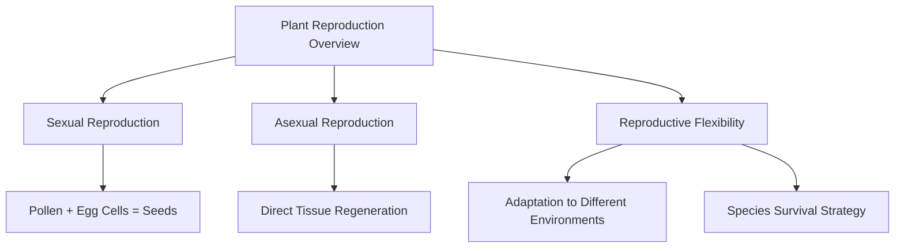

# Step-by-Step Solution

Step-by-Step Solution for Words in Context Question:

1. Rephrasing the Question:
"Which word best describes how plants create new individuals of their species?"

2. Evidence Analysis:
Key textual evidence:
- "reproduce through multiple reproductive strategies"
- "sexual reproduction... pollen combines with egg cells"
- "asexual reproduction... creating new individuals directly from existing tissue"

The passage explicitly discusses how plants generate new plant individuals through different methods.

3. Elimination Strategy:
- B) "extending" - Too vague, doesn't relate to reproduction
- C) "spreading" - Implies geographical distribution, not reproduction
- D) "multiplying" - Close, but lacks scientific precision

4. Correct Choice Analysis:
A) "propagating" is the most precise scientific term:
- Scientifically accurate: Directly means reproducing or generating new individuals
- Matches passage's description of reproductive mechanisms
- Encompasses both sexual and asexual reproduction methods
- Precise biological terminology

Rationale: "Propagating" in botanical contexts specifically means generating new plants through various reproductive strategies, perfectly matching the passage's description.

5. Test-Taking Reflection:
Quick reasoning steps:
- Read passage carefully
- Identify key scientific context
- Match word's precise meaning
- Eliminate imprecise choices
- Select most scientifically accurate term

Time-Pressure Tips:
- Scan for scientific keywords
- Understand reproductive context
- Choose most technically precise option

Correct Answer: A) propagating

This solution demonstrates a systematic, evidence-based approach to solving Words in Context questions in scientific passages.

# Key Strategies

SAT Reading: Words in Context Strategies for Natural Sciences Passages

Core Reading Approach:
For Natural Sciences passages, prioritize understanding the scientific argument's progression and technical vocabulary's precise meaning. Focus on:
- Tracking main research claims
- Identifying author's tone and perspective
- Recognizing subtle semantic nuances

Efficient Decoding Techniques:
1. Context Clue Mapping
- Immediately scan surrounding sentences when encountering a challenging word
- Look for:
  * Explanatory phrases
  * Contrasting language
  * Synonyms or implicit definitions
  * Technical context indicators

2. Vocabulary Strategy
- Eliminate obviously incorrect definitions
- Prioritize meanings consistent with scientific discourse
- Match word's connotation with passage's technical tone

Common SAT Traps:
- Tempting but semantically incorrect synonyms
- Words that sound scientific but don't match context
- Definitions that slightly misalign with passage's technical precision
- Overly complex or academic-sounding alternatives

Time Management:
- Allocate 12-13 minutes per passage
- Spend 30-45 seconds per Words in Context question
- Skip and return to challenging questions
- Mark potentially relevant sections for quick review

Practice Optimization:
- Use official College Board practice materials
- Analyze scientific journal/research article vocabulary
- Build discipline in systematic word analysis
- Practice active reading with scientific texts

Key Study Steps:
1. Develop scientific vocabulary database
2. Practice systematic context decoding
3. Learn to recognize subtle semantic shifts
4. Master rapid elimination techniques

Performance Boosters:
- Read scientific magazines (Nature, Scientific American)
- Complete timed SAT reading practice tests
- Analyze previous mistakes systematically
- Build confidence through structured preparation

Recommended Daily Practice: 30-45 minutes of targeted reading and vocabulary work, emphasizing scientific and academic texts.

By integrating these strategies, students can significantly improve their Words in Context performance, particularly in Natural Sciences passages.

# Moving Forward

Mastering Words in Context in Natural Sciences passages requires a strategic approach centered on close textual analysis and scientific reasoning. The key is to always ground your word interpretation in direct evidence from the passage, carefully examining how scientific language conveys precise meanings within specific research contexts.

When practicing, focus on understanding how technical terms function within their scientific framework, paying special attention to how authors use language to describe complex processes and relationships. A common pitfall is selecting answers that merely sound scientific without being truly supported by the text's specific language and context.

Remember that improving your Words in Context skills isn't just about test performance—it's about developing a more nuanced, analytical reading approach that will serve you in scientific comprehension far beyond any single exam. By practicing methodically and staying attentive to textual details, you'll transform this challenging question type into an opportunity for deeper scientific understanding.

## Time Management Guidelines
- Reading Time: 1 minutes
- Solving Time: 1 minutes

## Expert Tip
Notice how the text defines or contrasts a word, and double-check that the meaning fits the broader context.

---

# SAT Reading Tutorial: Transitions

# Introduction

Mastering Transitions in SAT Reading: Natural Sciences Edition

Transition questions are like the hidden hinges that connect ideas in scientific passages, and understanding them can be your secret weapon on the SAT Reading section. These questions typically ask you to "identify the relationship between sentences" or "choose the most logical transition that connects two ideas" using stems like "Which choice best shows the relationship between the previous and following sentences?" or "The author uses the transition to primarily…"

Why do these questions matter? They're not just about grammar—they're about comprehension. In Natural Sciences passages, particularly in life sciences, transitions reveal how scientific ideas evolve, connect, and build upon each other. A well-chosen transition can show contrast, support, cause and effect, or provide crucial context in complex biological or research-based texts.

Imagine you're reading a passage about cellular adaptation, and suddenly you need to determine how two seemingly different paragraphs relate. Is it a contrast? A continuation of an idea? This is where transition skills become critical. Life sciences passages often use transitions to explain complex processes, show evolutionary relationships, or highlight research methodology shifts.

Here's a quick exam-day scenario: You're reading a passage about genetic mutations, and you see sentences that seem disconnected. Your transition radar should immediately activate. Look for signal words like "however," "consequently," or "similarly" that reveal the underlying logical connection.

Pro Tip: In Natural Sciences passages, always ask yourself, "How do these scientific ideas logically connect?" This mindset will help you navigate transition questions with confidence and precision.

# General Strategy

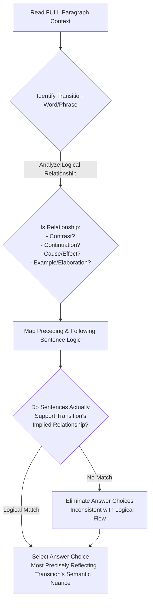

Key Design Principles:
- Forces systematic logical analysis
- Emphasizes understanding context
- Creates verification checkpoints
- Prevents hasty/superficial selection
- Teaches critical thinking, not just "tricks"

Would you like me to elaborate on any specific node or reasoning pathway?

# Practice

## Let's Practice

Here's a typical SAT Reading Natural Sciences passage that tests Transitions skills:

Chemical mutagenesis has proven effective in developing crop varieties with desirable traits. In a recent study, researchers sought to create herbicide-tolerant barley plants. The process began with selecting the barley cultivar Bob for treatment with sodium azide. _____ the seeds required careful preparation, they were first pre-soaked at 0°C for 16 hours and then at 20°C for 8 hours. Following this preparation, the seeds were treated with sodium azide for 2 hours. The treated seeds were then planted in isolation, and the resulting plants were harvested to collect the next generation of seeds.

Now, try this question:

Which choice completes the text with the most logical transition?

Consider these options:
- A) However,
- B) Because
- C) Therefore,
- D) Similarly,

Take a moment to think about your approach before reading the solution.

# Understanding the Passage

SAT Reading Natural Sciences Passage Analysis Guide

Active Reading Approach:
1. First Pass: Identify the core scientific process
  - Underline key scientific terms: "chemical mutagenesis", "sodium azide", "herbicide-tolerant"
  - Circle numerical data and experimental conditions
  - Mark the experimental progression (seed selection → preparation → treatment → isolation)

Key Textual Features:
- Objective, technical language
- Precise experimental methodology
- Quantitative measurements (temperatures, time durations)
- Focused on practical scientific application (crop development)

Scientific Passage Characteristics:
- Methodical description of research process
- Clear cause-and-effect structure
- Emphasis on reproducible experimental steps
- Neutral, informative tone

SAT-Tested Concept Examples:
1. Experimental Precision
  - Specific temperature stages: "0°C for 16 hours" and "20°C for 8 hours"
  - Demonstrates scientific rigor in experimental design

2. Research Methodology
  - Quote: "seeds were treated with sodium azide for 2 hours"
  - Highlights systematic approach to genetic modification

Transition Question Strategy:
Main Idea: Chemical mutagenesis as a technique for developing improved crop varieties

Author's Purpose: To explain a specific scientific method for creating herbicide-resistant barley

Transition Question Approach:
- Identify logical flow between experimental stages
- Look for words indicating progression or causality
- Understand how each experimental step connects to the next

Critical Reading Tactics:
- Track the experimental sequence
- Note specific scientific procedures
- Understand the research's practical implications
- Recognize the systematic nature of scientific investigation

Key Takeaway:
Successful comprehension requires:
1. Active annotation
2. Understanding scientific terminology
3. Tracking experimental logic
4. Recognizing the research's broader context

By applying these strategies, students can confidently navigate complex scientific passages, breaking down intricate experimental descriptions into clear, comprehensible steps.

Recommended Student Approach:
- Read slowly and deliberately
- Mark key scientific terms
- Visualize the experimental process
- Connect each step's purpose and significance

This analytical framework transforms a dense scientific text into an accessible, structured narrative of scientific discovery.

# Visual Analysis

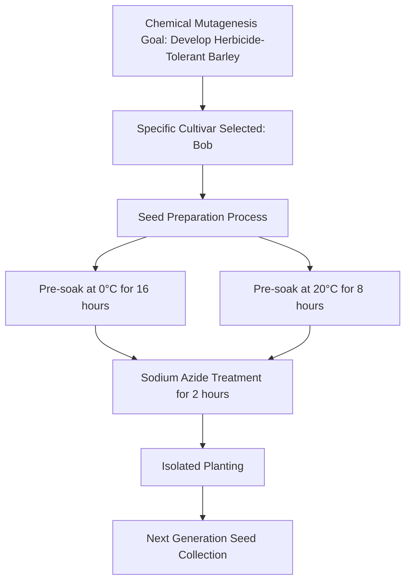

# Step-by-Step Solution

Step-by-Step Solution:

1. Rephrasing the Question:
"What transition best connects the idea of seed treatment with the specific preparation steps?"

2. Evidence Analysis:
Key passage context: The text describes a precise mutagenesis process involving seed preparation before sodium azide treatment.

Critical observation: The seeds undergo a specific multi-step preparation before chemical treatment.

3. Elimination Strategy:
- "However" (A): Implies contradiction, which doesn't match the sequential preparation steps
- "Similarly" (D): Suggests comparison to a previously described process, but no prior context exists
- "Therefore" (C): Suggests a direct logical consequence, but the preparation seems more explanatory
- "Because" (B): Explains the rationale behind the detailed preparation steps ✓

4. Reasoning for Correct Choice:
"Because" logically introduces the detailed explanation of why seeds require careful preparation:
- Provides causal connection
- Signals that the subsequent details explain the preparation's necessity
- Matches scientific writing's explanatory style

Specific Evidence:
- The preparation involves precise temperature-controlled soaking (0°C, 20°C)
- Suggests methodical scientific approach requiring justification

5. Test-Taking Reflection:
Quick reasoning steps:
- Identify the logical flow
- Look for causal relationships
- Eliminate choices that disrupt scientific explanation
- Choose the transition that most naturally introduces explanatory details

Recommended Approach:
- Read surrounding sentences carefully
- Understand the scientific process being described
- Select the transition that best maintains logical coherence

Correct Answer: B) Because

Rationale: "Because" introduces the detailed seed preparation steps as a necessary explanation for the mutagenesis process, maintaining the scientific text's logical progression and providing clear causal context.

Key Takeaway: In scientific passages, transitions should clarify relationships between ideas, especially when describing methodical processes.

# Key Strategies

SAT Reading Transitions Strategy for Natural Sciences Passages

Core Reading Approach:
Natural Sciences passages require a precise, analytical reading style focused on logical progression and scientific reasoning. Key techniques include:
- Tracking causal relationships between scientific concepts
- Identifying precise semantic shifts in research descriptions
- Recognizing how scientific arguments develop incrementally

Transition Question Strategies:
1. Keyword Detection
- Look for signal words: "however", "consequently", "nevertheless"
- Analyze how these words indicate logical relationships
- Understand how scientific arguments pivot or expand

2. Evidence Identification Techniques
- Always reference line numbers explicitly
- Create quick mental summaries of paragraph transitions
- Note how scientific evidence builds or challenges previous claims

Common SAT Transition Traps:
- Seemingly plausible but contextually incorrect connections
- Subtle logical misalignments
- Transitions that sound scientific but lack precise meaning
- Choices that disrupt the passage's technical coherence

Time Management:
- Allocate 12-13 minutes per passage
- Spend 2-3 minutes initially scanning transition points
- Practice identifying transition logic within 30-45 seconds
- Flag challenging transitions for quick revisit

Practical Preparation Steps:
- Analyze past SAT Natural Sciences passages
- Practice extracting core argumentative threads
- Develop rapid pattern recognition for scientific reasoning
- Complete timed transition-focused practice sets

Critical Practice Recommendation:
Simulate real test conditions by practicing with official College Board materials, focusing specifically on scientific reasoning and logical progression.

By systematically applying these strategies, students can significantly improve their performance on Natural Sciences Transition questions.

# Moving Forward

Here's a concise conclusion for Transitions questions in Natural Sciences passages:

Mastering Transitions questions ultimately requires a disciplined approach focused on close textual evidence and logical relationships between scientific ideas. The key is training yourself to read carefully, tracking how authors connect scientific concepts and build logical arguments through strategic word choices.

When practicing, always prioritize direct textual support over intuitive-sounding answers. Many students mistakenly select transitions that feel right but lack concrete connection to the passage's actual logical structure. Instead, systematically analyze how each transition word signals a specific relationship—contrast, continuation, example, or consequence.

Remember that improving your Transitions skills isn't just about test performance—it's about developing a more sophisticated scientific reading comprehension. By becoming more attentive to subtle linguistic signals, you'll not only boost your score but also enhance your ability to understand complex scientific reasoning across disciplines.

Stay patient, stay precise, and trust the process.

## Time Management Guidelines
- Reading Time: 1 minutes
- Solving Time: 1 minutes

## Expert Tip
Look for signaling words or phrases that indicate logical shifts or additions.

---

# SAT Reading Tutorial: Text Structure and Purpose

# Introduction

Text Structure and Purpose Questions in Natural Sciences: Your Strategic Guide

When you encounter Text Structure and Purpose questions in SAT Reading, especially within Natural Sciences passages, you're essentially being asked to become a scientific detective. These questions typically ask you to identify why an author wrote a specific passage, how information is organized, or the primary purpose behind a particular section of text.

Common question stems include: "The primary purpose of the passage is to...", "The author's main approach in discussing the research is...", or "The structure of the paragraph suggests that the writer aims to...". These questions are critical because they test your ability to move beyond surface-level comprehension and understand the deeper strategic choices authors make when presenting scientific information.

Natural Sciences passages, particularly in life sciences, often use specific structural techniques: comparing research methodologies, explaining complex biological processes, or tracing the development of scientific understanding. A typical life sciences text might, for instance, introduce a biological mechanism, explain its components, and then discuss its broader implications.

Imagine you're midway through the reading section, and you see a passage about cellular communication. A quick strategy is to immediately identify the passage's "skeleton"—its main sections and how they connect. Is it describing a process? Comparing theories? Evaluating a scientific problem?

Quick Tip: Always look for signal phrases like "consequently," "however," or "in contrast" to understand how the author is structuring scientific information and building their argument.

By mastering Text Structure and Purpose questions, you're not just reading—you're analyzing how scientific knowledge is constructed and communicated. Stay focused, be strategic, and trust your analytical skills.

# General Strategy

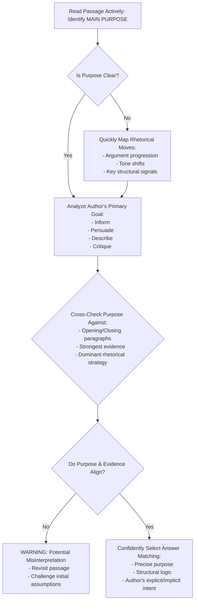

The diagram captures a strategic, methodical approach that experienced SAT tutors recommend for Text Structure and Purpose questions.

# Practice

## Let's Practice

Here's a typical SAT Reading Natural Sciences passage that tests Text Structure and Purpose skills:

The pistachio tree presents a fascinating example of specialized plant reproduction. Unlike many common fruit trees, pistachios have separate male and female trees, each producing their own distinct flowers. Commercial growers must carefully manage pollination to ensure a successful crop. The female trees produce clusters of small, delicate flowers that await pollen from their male counterparts. Interestingly, male trees typically bloom earlier in the season than females. To address this timing mismatch, farmers collect pollen from male flowers when available and store it in cool conditions until female flowers are ready. This careful timing and storage process helps maximize crop yields and maintain genetic diversity in pistachio orchards. Without such careful management, natural wind pollination alone would be far less efficient for commercial production.

Now, try this question:

Which choice best describes the main purpose of this passage?

Consider these options:
- A) To explain how commercial pistachio growers manage pollination challenges
- B) To compare male and female pistachio trees
- C) To argue for better farming practices in pistachio orchards
- D) To describe the history of pistachio cultivation

Take a moment to think about your approach before reading the solution.

# Understanding the Passage

SAT Reading Strategy: Analyzing the Pistachio Reproduction Passage

Active Reading Approach:
When first encountering this passage, students should:
- Underline key scientific terms (e.g., "pollination," "male and female trees")
- Circle main ideas about reproductive strategies
- Note the progression from biological description to agricultural practice
- Mark any surprising or unique information (separate male/female trees)

Key Textual Features:
1. Scientific Explanation Style
- Objective, informative tone
- Focuses on biological mechanism
- Blends botanical description with practical agricultural implications
- Uses precise, technical language

Main Idea Breakdown:
The passage explains the unique reproductive system of pistachio trees, emphasizing how specialized pollination requires deliberate human intervention to ensure crop production.

Specific SAT-Tested Concepts:

Concept 1: Reproductive Specialization
Quote: "Unlike many common fruit trees, pistachios have separate male and female trees"
- Demonstrates biological variation
- Highlights complexity of plant reproduction
- Shows how species develop unique survival strategies

Concept 2: Human Agricultural Management
Quote: "farmers collect pollen from male flowers when available and store it in cool conditions"
- Illustrates human technological intervention
- Demonstrates scientific problem-solving
- Shows adaptation to natural biological limitations

Purpose and Structure:
The author's purpose is to:
- Explain a specialized botanical reproductive process
- Describe agricultural techniques
- Highlight the complexity of plant reproduction

Reading Strategy:
1. First read: Get overall understanding
2. Second read: Annotate and analyze details
3. Look for cause-effect relationships
4. Identify scientific reasoning patterns

Key Takeaway:
This passage demonstrates how scientific writing combines descriptive explanation with practical application, requiring readers to synthesize biological information and understand complex systems.

Recommended Student Approach:
- Read actively
- Identify main scientific concepts
- Look for cause-effect relationships
- Understand both biological mechanism and human intervention

By applying these strategies, students can effectively navigate complex scientific passages and confidently answer SAT reading comprehension questions.

# Visual Analysis

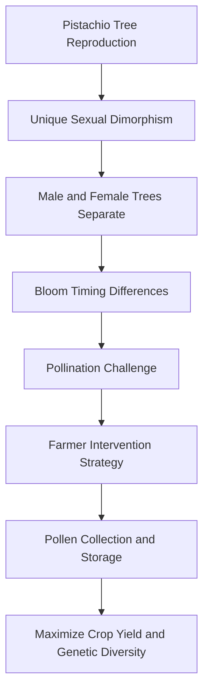

# Step-by-Step Solution

Step-by-Step Solution:

1. Rephrasing the Question:
"What is the primary goal of the author in writing this passage about pistachio tree reproduction?"

2. Evidence Analysis:
Key evidence points:
- Focus on pollination process
- Detailed explanation of male/female tree interactions
- Emphasis on commercial growing strategies

Critical quote: "To address this timing mismatch, farmers collect pollen from male flowers when available and store it in cool conditions until female flowers are ready."

This quote reveals the passage's central explanatory purpose about pollination management.

3. Eliminating Trap Choices:
- Choice B: Partially true but too narrow; comparison is not the main purpose
- Choice C: No argumentative tone; passage is descriptive, not persuasive
- Choice D: No historical context provided; purely focused on current cultivation techniques

4. Confirming Correct Choice (A):
Why it matches:
- Directly addresses the passage's technical explanation
- Captures the detailed description of pollination challenges
- Aligns with Natural Sciences text structure: informative and process-oriented
- Meets SAT reading standards by focusing on main informational purpose

5. Test-Taking Strategy:
Quick reasoning under pressure:
- Scan for central focus
- Identify key technical details
- Look for comprehensive explanation
- Avoid choices with extreme language
- Prioritize the most comprehensive, evidence-supported option

Reflection: The correct answer (A) comprehensively captures the passage's purpose of explaining the intricate pollination management in pistachio cultivation.

Reasoning Process:
1. Identify main topic (pistachio reproduction)
2. Recognize technical explanation style
3. Match passage content to answer choices
4. Eliminate less accurate options
5. Confirm most precise description

Key Takeaway: Focus on the passage's primary informational goal, not peripheral details.

Recommended Time: 30-45 seconds per purpose/structure question.

# Key Strategies

SAT Reading Strategies for Natural Sciences Text Structure and Purpose Questions

Core Reading Approach:
For Natural Sciences passages, adopt a strategic reading method that prioritizes understanding the scientific argument's progression. Focus on:
- Identifying the primary research question or hypothesis
- Tracking how evidence supports or challenges the central claim
- Noting methodological transitions and experimental reasoning

Key Techniques:
1. Active Reading Strategies
- Underline key scientific terminology
- Mark structural shifts in argument
- Create quick margin notes about paragraph function
- Highlight cause-effect relationships

2. Evidence Identification Tactics
- Look for signal phrases like "consequently," "however," "moreover"
- Pay attention to transition sentences that indicate research progression
- Recognize how each paragraph contributes to overall scientific explanation

Common SAT Traps to Avoid:
- Misinterpreting nuanced scientific language
- Confusing descriptive versus analytical paragraph purposes
- Overlooking subtle argument qualifications
- Assuming linear progression in complex scientific arguments

Time Management:
- Allocate 12-13 minutes per passage
- First pass: 3-4 minutes reading
- Second pass: 5-6 minutes answering questions
- Reserve 2-3 minutes for review/verification

Practice Optimization:
- Use official College Board practice materials
- Analyze scientific journal article structures
- Practice extracting main ideas quickly
- Develop scientific vocabulary comprehension

Critical Performance Boosters:
- Practice identifying implicit versus explicit arguments
- Learn to distinguish between observation, hypothesis, and conclusion
- Develop rapid pattern recognition in scientific reasoning

Recommended Study Approach:
- Complete 2-3 timed practice passages weekly
- Review incorrect answers forensically
- Build scientific reading stamina progressively

By systematically applying these strategies, students can significantly improve their performance on Natural Sciences Text Structure and Purpose questions.

# Moving Forward

Mastering Text Structure and Purpose in Natural Sciences passages requires a disciplined approach centered on close textual evidence and analytical thinking. The key is to consistently trace how authors construct arguments, organize scientific information, and communicate complex ideas. When practicing, focus on identifying the underlying rhetorical strategies—whether comparing research methods, explaining experimental outcomes, or synthesizing scientific observations.

A common pitfall is selecting answers that superficially sound scientific without directly connecting to the passage's specific language and logic. Always ground your interpretation in explicit textual support, carefully matching the passage's tone and structural cues.

Practice active reading by annotating passages, mapping out their logical progression, and critically examining how each paragraph contributes to the overall scientific argument. By developing these skills, you'll not only improve your test performance but also enhance your ability to comprehend and critically engage with scientific texts.

Stay curious, stay analytical, and trust the evidence.

## Time Management Guidelines
- Reading Time: 2 minutes
- Solving Time: 1.5 minutes

## Expert Tip
Identify how paragraphs and transitions lead to the author's main argument and shape the overall structure.

---

# SAT Reading Tutorial: Central Ideas and Details

# Introduction

Mastering Central Ideas and Details in SAT Reading: Your Natural Sciences Strategy Guide

When you're facing the SAT Reading section, Central Ideas and Details questions are your secret weapon for maximizing your score—especially in Natural Sciences passages. These questions typically ask you to identify main arguments, summarize key points, or explain how specific details support broader scientific concepts. You'll see question stems like "The primary purpose of the passage is...", "Which statement best describes the central idea...", or "The author uses the example of X to illustrate..."

Why do these questions matter? They're not just about reading comprehension—they're about understanding how scientific arguments are constructed. In Life Sciences passages particularly, you'll need to track how specific research findings or biological mechanisms connect to larger explanatory frameworks.

Imagine you're sitting in the testing room, and a passage about cellular metabolism appears. Your brain might initially feel overwhelmed by technical details. But here's your game plan: Look for the "big picture" first. Scientific texts typically introduce a central hypothesis or research question early, then use detailed evidence to support or explore that core idea.

Quick Pro Tip: In Natural Sciences passages, the first and last paragraphs are your roadmap. The opening usually states the central scientific concept, while the conclusion typically reinforces or synthesizes the key insights.

Think of these questions like a scientific investigation: You're not just reading words, you're decoding how knowledge is built, step by systematic step. By treating each passage as a puzzle waiting to be solved, you'll transform what seems complex into a strategic opportunity to showcase your analytical skills.

Ready to dive deeper? Let's break down exactly how to conquer these questions.

# General Strategy

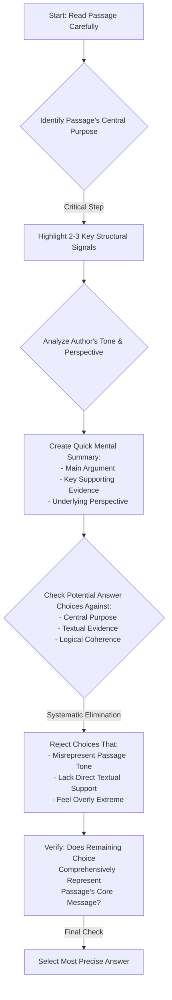

Key Design Principles:
- Emphasizes systematic thinking
- Highlights verification stages
- Focuses on evidence-based reasoning
- Provides structured decision framework

Would you like me to elaborate on any specific node or decision point in this strategy?

# Practice

## Let's Practice

Here's a typical SAT Reading Natural Sciences passage that tests Central Ideas and Details skills:

Plant breeders have developed innovative methods to create improved crop varieties. One notable example is the development of Calrose 76, a rice cultivar created through mutation breeding. Scientists began with the original Calrose variety and exposed its seeds to different levels of radiation. This approach offered a significant advantage: when using an established cultivar as the starting point, researchers sometimes discover mutations that create an immediately viable new variety without requiring additional breeding steps. However, this isn't always the case. Often, plants with desired mutations may have other unwanted traits, requiring further breeding work to develop a successful new variety. In the Calrose project, researchers treated over 2,000 seeds with varying doses of radiation to identify beneficial mutations.

Now, try this question:

Which choice best states the main idea of the text?

Consider these options:
- A) The process of mutation breeding can create new crop varieties either directly or through additional breeding steps
- B) The Calrose 76 rice variety was developed using radiation treatment
- C) Scientists must be careful when using radiation in plant breeding
- D) Plant breeding requires treating thousands of seeds with radiation

Take a moment to think about your approach before reading the solution.

# Understanding the Passage

SAT Reading Natural Sciences Passage Analysis Guide

Active Reading Approach:
1. Initial Annotation Strategy:
- Underline key scientific terms (mutation breeding, radiation)
- Circle numerical data points (2,000 seeds, ~200-350 seeds)
- Mark tone shifts (from technical description to explanatory commentary)
- Note cause-effect relationships

Key Textual Features:
- Technical scientific language
- Procedural description of research methodology
- Balanced presentation of both potential benefits and challenges
- Objective, informative tone
- Concrete example-driven explanation

SAT-Tested Concept Examples:
1. Scientific Process Illustration
Quote: "Scientists began with the original Calrose variety and exposed its seeds to different levels of radiation."
Concept: Experimental design and controlled variable manipulation

2. Nuanced Scientific Reasoning
Quote: "Often, plants with desired mutations may have other unwanted traits, requiring further breeding work"
Concept: Complexity of scientific research, acknowledging limitations

Main Idea & Purpose Analysis:
- Main Idea: Plant breeders use mutation breeding to develop improved crop varieties
- Author's Purpose: Explain an innovative agricultural research technique
- Comprehension Strategy: Understand the process, challenges, and potential benefits

Question Preparation Tactics:
- Identify central claims about mutation breeding
- Track the logical progression of scientific reasoning
- Note specific details that support broader scientific principles
- Recognize the balanced, objective presentation of scientific information

Key Takeaway: Approach scientific passages systematically, focusing on methodology, evidence, and underlying scientific principles.

Recommended Reading Approach:
1. Read actively and critically
2. Annotate methodically
3. Identify structural and conceptual patterns
4. Connect specific details to broader scientific contexts

This approach transforms complex scientific text into an accessible, comprehensible narrative, enabling more confident SAT reading performance.

# Visual Analysis

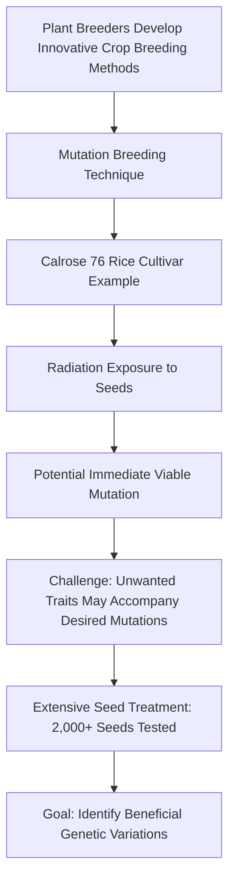

# Step-by-Step Solution

Solution Strategy for Central Ideas and Details Question

1. Rephrasing the Question:
"What is the primary message or overarching concept that the passage communicates about mutation breeding?"

2. Evidence Identification:
Key evidence comes from the passage's central explanation:
- "One notable example is the development of Calrose 76, a rice cultivar created through mutation breeding."
- "...when using an established cultivar as the starting point, researchers sometimes discover mutations that create an immediately viable new variety without requiring additional breeding steps."
- "Often, plants with desired mutations may have other unwanted traits, requiring further breeding work to develop a successful new variety."

3. Elimination Process:
- Choice B is too narrow, focusing only on one specific variety
- Choice C introduces a safety concern not emphasized in the passage
- Choice D focuses on a procedural detail, not the main conceptual point
- Choice A captures the nuanced process described in the passage

4. Rationale for Correct Answer (A):
This choice directly reflects the passage's core message:
- Acknowledges the two potential pathways in mutation breeding
- Matches the text's description of sometimes direct and sometimes multi-step variety development
- Aligns with scientific communication standards of presenting complex processes comprehensively

5. Test-Taking Strategy:
Under time pressure:
- Quickly identify the passage's central explanation
- Look for a choice that captures the broadest, most inclusive interpretation
- Avoid choices that are overly specific or introduce external information
- Prioritize answers that reflect the passage's explanatory tone

Recommended Approach:
- Read the passage holistically
- Identify the core scientific process being described
- Select the answer that most comprehensively represents that process

The correct answer is A, as it encapsulates the nuanced description of mutation breeding presented in the passage.

Key Takeaway: Central Ideas questions require understanding the passage's fundamental message, not just isolated details.

# Key Strategies

SAT Reading Strategies for Natural Sciences Passages: Central Ideas and Details

Core Reading Approach:
For Natural Sciences passages, adopt a strategic reading method that prioritizes understanding the core scientific argument and structural progression. Begin by quickly scanning the passage's first and last paragraphs to establish the fundamental scientific context and main research perspective.

Key Techniques:
1. Active Reading Strategy
- Underline key scientific terminology
- Mark major claim transitions
- Note cause-effect relationships
- Highlight quantitative or experimental references

2. Evidence Identification Tactics
- Look for explicit research objectives
- Track methodological descriptions
- Identify comparative statements
- Recognize hypothesis/conclusion markers

Common SAT Traps to Avoid:
- Overly specific answer choices disconnected from passage's main argument
- Answers that sound scientific but misrepresent core evidence
- Choices that introduce external scientific information not mentioned
- Answers that exaggerate or minimize research implications

Time Management:
- Allocate 12-13 minutes per passage
- First pass: 3-4 minutes reading
- Second pass: 5-6 minutes answering questions
- Final review: 2-3 minutes checking work

Performance Boosting Practice:
- Complete timed scientific reading practice sets
- Analyze past SAT Natural Sciences passages
- Build scientific vocabulary
- Practice rapid comprehension of complex research descriptions

Critical Success Factors:
- Maintain objective, analytical reading approach
- Don't get bogged down in technical details
- Focus on overall research argument
- Connect specific details to broader scientific context

Recommended Study Routine:
- Weekly scientific reading (journals, research summaries)
- Systematic SAT practice passages
- Vocabulary development
- Timed comprehension exercises

By integrating these strategies, students can systematically improve their performance on Central Ideas and Details questions in Natural Sciences passages.

# Moving Forward

Mastering Central Ideas and Details in Natural Sciences passages requires a disciplined, evidence-based approach. The key is to remain focused on the text's explicit claims and supporting information, always tracing arguments back to the source material. When practicing, develop the habit of actively annotating passages, highlighting main ideas and critical supporting details that substantiate the author's core message.

A common pitfall is selecting answers that sound scientifically plausible but aren't directly supported by the text. Always prioritize textual evidence over intuitive assumptions. Remember that these questions test your ability to comprehend scientific communication precisely and systematically.

By consistently practicing close reading and maintaining a methodical approach to analyzing scientific texts, you'll not only improve your test performance but also develop critical analytical skills valuable across academic and professional domains. Stay patient, stay precise, and trust the process of careful comprehension.

## Time Management Guidelines
- Reading Time: 2 minutes
- Solving Time: 2 minutes

## Expert Tip
Focus on the main argument and how key details clarify or reinforce it.

---

# SAT Reading Tutorial: Command of Evidence (Textual, Quantitative)

# Introduction

Here's a draft introduction:

Command of Evidence questions in SAT Reading aren't just another test hurdle—they're your strategic opportunity to demonstrate precise analytical thinking, especially within Natural Sciences passages. These questions challenge you to do more than simply understand text; they require you to pinpoint exactly how and why you've reached a specific interpretation.

Typically, you'll encounter stems like "Which quote most strongly supports the previous answer?" or "Which data point best illustrates the researcher's central claim?" In Natural Sciences—particularly Life Sciences—these questions test your ability to trace scientific reasoning from evidence to conclusion. A biology passage might describe cellular mutation and then ask you to select the precise textual reference that validates a specific claim about genetic processes.

Why are these questions crucial? They're essentially a two-step reasoning challenge that rewards careful, methodical reading. By requiring you to not just comprehend content, but to demonstrate the logical connections between evidence and interpretation, these questions mirror real scientific reasoning.

Imagine you're taking the exam and encounter a passage about evolutionary adaptation. Suddenly, a Command of Evidence question appears. Your heart might race—but here's a quick pro tip: Always return to the specific details in the text, tracing the logical pathway between claim and supporting information.

The key is staying calm, systematic, and confident. These questions aren't designed to trick you, but to assess your ability to think like a careful, precise scientific reader. By understanding their structure and practicing strategic approaches, you'll transform what seems challenging into an opportunity to showcase your analytical skills.

# General Strategy

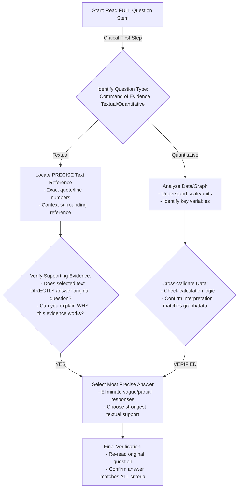

Key Design Principles:
- Emphasizes systematic verification
- Distinguishes between Textual/Quantitative approaches
- Builds in critical thinking checkpoints
- Focuses on precision over speed

Would you like me to elaborate on any specific node or decision point in the strategy?

# Practice

## Let's Practice

Here's a typical SAT Reading Natural Sciences passage that tests Command of Evidence (Textual, Quantitative) skills:

The use of five dosages increased the chance of finding one dosage that would result in an adequate mutation frequency. The use of a control treatment made it possible to assess how each of the dosages influenced germination and the frequency of mutation. Before treatment, the seeds were brought to 14% moisture. Adjustment of moisture would be considered a pretreatment. It is assumed that the breeder had some prior knowledge that this step would be useful when using cobalt-60 radiation. The M1 seeds were planted in the field. Although rice is self-pollinated, the M1 plants were isolated by 11 m from untreated rice genotypes to prevent outcrossing. ________

Now, try this question:

Which quotation from the passage best supports the idea that the experiment was designed to compare different treatment effects?

Consider these options:
A) "The use of five dosages increased the chance of finding one dosage that would result in an adequate mutation frequency."
B) "Before treatment, the seeds were brought to 14% moisture."
C) "The M1 seeds were planted in the field."
D) "Although rice is self-pollinated, the M1 plants were isolated by 11 m from untreated rice genotypes"

Take a moment to think about your approach before reading the solution.

# Understanding the Passage

SAT Reading Natural Sciences Passage Analysis Guide

Active Reading Approach:
1. Annotation Strategy:
- Underline key scientific terminology (e.g., "mutation frequency", "cobalt-60 radiation")
- Circle numerical data and measurements (14% moisture, 11 m isolation)
- Mark methodological steps with brackets
- Note researcher's implied assumptions

Key Passage Characteristics:
- Technical, objective scientific writing style
- Experimental methodology description
- Precise quantitative details
- Implicit scientific reasoning

Critical Analytical Insights:

Main Scientific Context:
This passage describes a plant breeding experiment involving radiation-induced mutation in rice seeds. The researcher is systematically exploring genetic modification techniques through controlled radiation exposure.

Specific SAT-Tested Concept Examples:
1. Experimental Design Evidence (Lines 1-3):
- Multiple dosage approach demonstrates scientific rigor
- Control treatment allows comparative analysis
- Quote: "five dosages increased the chance of finding one dosage that would result in an adequate mutation frequency"

2. Methodological Precision (Lines 4-7):
- Precise moisture adjustment (14%)
- Deliberate isolation technique (11m separation)
- Demonstrates understanding of experimental variables

Purpose and Main Idea:
- Describe a controlled scientific mutation experiment
- Illustrate systematic approach to genetic modification
- Showcase experimental design principles

Question Preparation Strategies:
- Identify explicit methodological steps
- Recognize implicit scientific reasoning
- Connect quantitative details to experimental goals

Key Takeaway: Systematic observation, precise measurement, and controlled variables are fundamental to scientific research methodology.

Recommended Student Approach:
1. Read actively with scientific curiosity
2. Mark key methodological steps
3. Identify numerical/quantitative details
4. Understand implicit experimental reasoning
5. Connect specific techniques to broader scientific objectives

This analytical framework helps students deconstruct complex scientific passages by focusing on structure, methodology, and underlying scientific reasoning.

# Visual Analysis

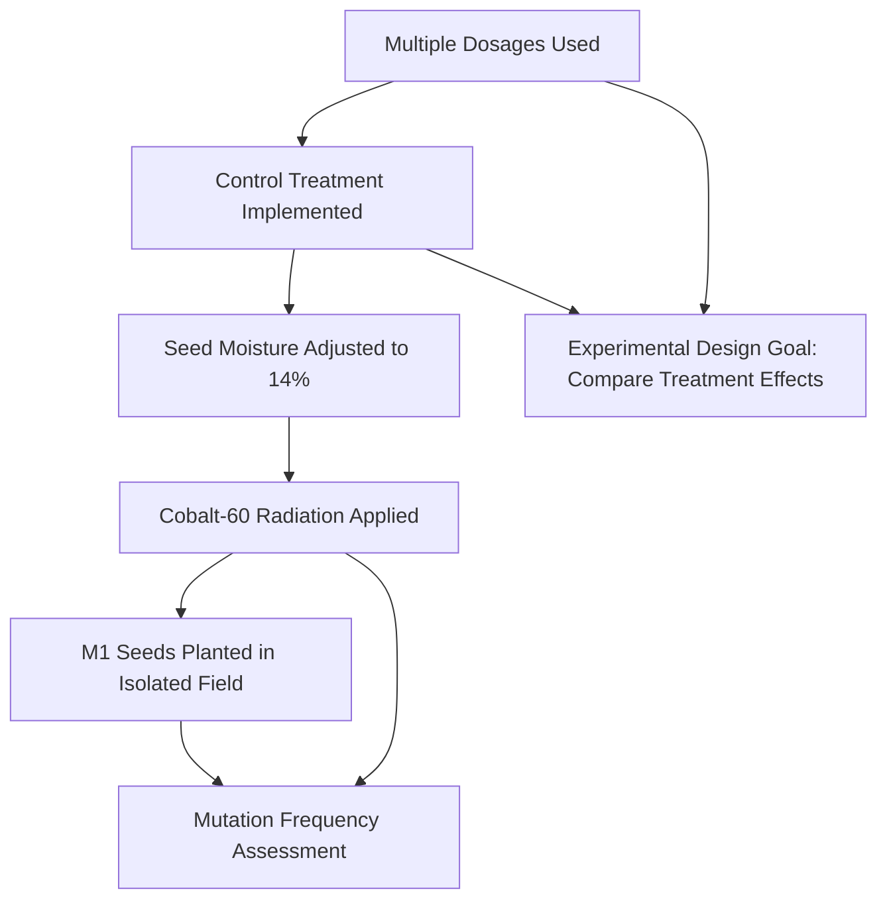

# Step-by-Step Solution

Solution Walkthrough:

1. Rephrasing the Question:
Clarify: "Which quote provides the strongest evidence that the experiment was designed to systematically compare different treatment effects?"

2. Evidence Location Strategy:
- Focus on methodological language indicating comparative design
- Look for phrases suggesting intentional variation and controlled comparison

Key Evidence Quote: "The use of five dosages increased the chance of finding one dosage that would result in an adequate mutation frequency. The use of a control treatment made it possible to assess how each of the dosages influenced germination and the frequency of mutation."

3. Elimination Process:
- Choice B (moisture adjustment): Preparatory step, not comparative design
- Choice C (field planting): Describes location, not experimental comparison
- Choice D (isolation): Prevents genetic contamination, not treatment comparison
- Choice A: Directly describes using multiple dosages to systematically explore mutation frequencies

Trap Avoidance:
- Reject answers describing procedural details
- Prioritize quotes explicitly discussing experimental design and comparison

4. Matching Passage and Standards:
Choice A demonstrates:
- Intentional variation of dosages
- Systematic approach to finding optimal mutation conditions
- Explicit statement of experimental design goal

Aligns with SAT reading standards by:
- Identifying precise textual evidence
- Connecting quote to experimental methodology
- Showing analytical comprehension of scientific reasoning

5. Time-Pressure Strategies:
- Quickly scan for methodological language
- Look for phrases like "increased chance," "control treatment," "assess"
- Prioritize quotes describing experimental design, not just procedural steps
- Practice identifying comparative design markers in scientific texts

Correct Answer: A

Reflection: This approach transforms close reading into a structured, strategic process by focusing on methodological language and experimental design indicators.

Key Takeaway: In scientific passages, look for quotes that explicitly discuss how the experiment was designed to compare or systematically explore different conditions.

# Key Strategies

SAT Reading: Command of Evidence Strategies for Natural Sciences Passages

Reading Techniques:
For Natural Sciences passages, adopt a strategic reading approach that prioritizes:
- Identifying core scientific arguments
- Tracking experimental methodology descriptions
- Recognizing data interpretation patterns
- Noting cause-and-effect relationships
- Highlighting quantitative evidence and statistical claims

Key Evidence Spotting Strategies:
- Underline topic sentences and concluding statements
- Circle numerical data, percentages, and comparative language
- Mark transitions between hypothesis, methodology, and results
- Create quick margin annotations tracking argument progression
- Reference line numbers immediately when answering questions

Common SAT Command of Evidence Traps:
- Mismatched evidence citations
- Subtle language shifts in supporting statements
- Deliberately misleading statistical representations
- Evidence that sounds plausible but doesn't precisely match the original text
- Quantitative claims that seem related but lack direct textual support

Time Management Approach:
- Allocate 12-13 minutes per passage
- First pass: 3-4 minutes reading and annotating
- Second pass: 5-6 minutes answering questions
- Final 2-3 minutes reviewing and cross-checking evidence

Performance Improvement Steps:
- Practice with official College Board Natural Sciences passages
- Develop systematic annotation techniques
- Learn to quickly distinguish primary from secondary evidence
- Master skimming techniques for scientific texts
- Regularly practice timed, focused reading comprehension

Critical Practice Recommendation:
Complete 2-3 timed Natural Sciences passages weekly, focusing specifically on evidence selection and verification skills. Analyze mistakes systematically, tracking patterns in your error types.

By implementing these targeted strategies, students can significantly enhance their Command of Evidence performance in SAT Reading's scientific passages.

# Moving Forward

Here's a concise conclusion for Command of Evidence questions in Natural Sciences passages:

Mastering Command of Evidence questions requires a disciplined, evidence-driven approach. The key is always returning to the text, carefully tracing claims to their precise textual or quantitative sources, and resisting the temptation to rely on prior knowledge or intuition. When practicing, focus on developing a systematic method: first, thoroughly understand the passage's core argument, then methodically track how specific evidence supports or challenges that argument.

The most common pitfall is selecting an answer that seems plausible but lacks direct textual support. Always demand clear, explicit connections between the passage and your chosen response. Remember, these questions aren't about what you think might be true, but what the text definitively demonstrates.

By consistently practicing this evidence-centered reading strategy, you'll not only improve your test performance but also develop critical analytical skills that extend far beyond standardized testing. Stay patient, stay precise, and trust the evidence.

## Time Management Guidelines
- Reading Time: 2 minutes
- Solving Time: 2 minutes

## Expert Tip
Locate explicit textual or quantitative evidence that validates your chosen answer.

---

# SAT Reading Tutorial: Inferences

# Introduction

Mastering Inferences in SAT Reading: Natural Sciences Edition

Inferences questions are your secret weapon in the SAT Reading section, especially when navigating the intricate world of Natural Sciences passages. These questions challenge you to read between the lines, drawing logical conclusions that aren't directly stated but are strongly supported by the text.

Typically, you'll encounter stems like "Based on the passage, we can reasonably conclude that..." or "The author most likely suggests that..." In Natural Sciences passages—particularly in life sciences—these questions test your ability to understand complex scientific reasoning beyond literal text. Imagine a passage about genetic research: an inference question might ask you to extrapolate the broader implications of a specific experimental finding.

Why are these questions crucial? They represent your critical thinking skills. The SAT wants to see if you can synthesize information, make sophisticated connections, and demonstrate deep comprehension—not just regurgitate surface-level details.

Here's a quick exam-day strategy: When you see an inference question, first highlight key evidence in the passage. In life sciences texts, look for subtle language cues like "suggests," "implies," or phrases indicating tentative scientific conclusions. Then, systematically eliminate answer choices that aren't directly supported by textual evidence.

Pro Tip: In Natural Sciences passages, always ground your inference in observable data or explicitly stated scientific principles. Your conclusion should feel like a logical extension of the text, not a wild speculation.

Remember, inference questions aren't about guessing—they're about intelligent, evidence-based reasoning. You've got this!

# General Strategy

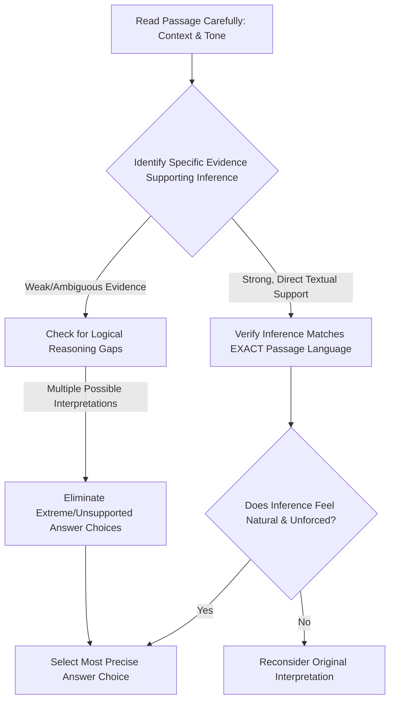

Key Design Rationale:
- Emphasizes close reading and evidence-based reasoning
- Shows critical decision points in inference analysis
- Highlights importance of textual precision
- Builds in verification/self-checking steps
- Reflects expert test-taking strategy, not just generic advice

Would you like me to elaborate on any specific node or the overall inference-solving approach?

# Practice

## Let's Practice

Here's a typical SAT Reading Natural Sciences passage that tests Inferences skills:

Marine biologists have long been fascinated by the feeding patterns of whales. Blue whales, despite being the largest animals on Earth, survive primarily on tiny crustaceans called krill. During feeding season, these massive creatures can consume up to 6 tons of krill each day. The whales use a unique feeding method called filter feeding, where they take in enormous amounts of water and filter out their prey using specialized structures called baleen plates. This process is ___________, allowing the whales to efficiently capture large quantities of their small prey while expelling excess water.

Now, try this question:

Which choice most logically completes the text?

Consider these options:
- A) remarkably streamlined
- B) somewhat dangerous
- C) occasionally successful
- D) randomly executed

Take a moment to think about your approach before reading the solution.

# Understanding the Passage

SAT Reading Passage Analysis: Marine Biology Passage

Active Reading Approach:
1. Initial Annotation Strategy:
- Underline key scientific terms (krill, filter feeding, baleen plates)
- Circle numerical data (6 tons, largest animals)
- Note the central focus: whale feeding mechanisms

Key Passage Features:
- Descriptive scientific explanation
- Objective, informative tone
- Focuses on biological adaptation
- Presents factual information about whale feeding behavior

Main Idea Analysis:
The passage explores how blue whales, Earth's largest animals, survive by efficiently consuming massive quantities of tiny crustaceans through a specialized feeding technique.

Purpose Identification:
The author aims to explain the remarkable biological adaptation that enables whales to sustain themselves despite their enormous size.

Strategic Reading Tactics:
1. Recognize the scientific context: Marine biology description
2. Identify specific details that demonstrate biological complexity
3. Note the surprising contrast (largest animals eating tiny organisms)

SAT-Tested Concept Examples:
- Biological adaptation example: "filter feeding" mechanism
- Quantitative data point: "6 tons of krill each day"
- Descriptive scientific language demonstrating precise observation

Inference Question Preparation:
- Understand the passage's core explanation of whale feeding
- Recognize the relationship between biological structure (baleen plates) and feeding strategy
- Anticipate questions about evolutionary advantages of this feeding method

Key Comprehension Strategies:
- Read actively with scientific curiosity
- Look for cause-and-effect relationships
- Pay attention to technical terminology
- Consider the broader ecological implications

By systematically breaking down the passage's scientific description, students can develop a comprehensive understanding and prepare effectively for related SAT Reading questions.

Recommended Approach:
1. Read carefully
2. Annotate strategically
3. Identify main ideas
4. Analyze scientific mechanisms
5. Prepare for potential inference questions

# Visual Analysis

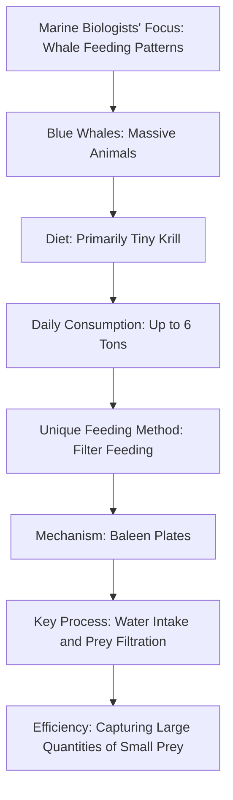

# Step-by-Step Solution

Step-by-Step Solution:

1. Rephrasing the Question:
What descriptive term best characterizes the whale's filter feeding mechanism based on the passage's scientific description?

2. Evidence Analysis:
Key evidence comes from these passage details:
- Whales consume "up to 6 tons of krill each day"
- They use "filter feeding" method
- They take in "enormous amounts of water"
- They filter prey using "specialized structures called baleen plates"

Direct quote highlighting the mechanism: "take in enormous amounts of water and filter out their prey"

3. Elimination Strategy:
- Choice B (dangerous): Contradicts the passage's neutral, scientific tone
- Choice C (occasionally successful): Inconsistent with the precise description of an evolved feeding mechanism
- Choice D (randomly executed): Directly opposes the passage's implication of a sophisticated, precise process

4. Rationale for Correct Answer:
Choice A (remarkably streamlined) matches the passage because:
- "Streamlined" suggests efficiency
- Aligns with the description of a precise biological adaptation
- Reflects the scientific precision of the feeding mechanism
- Captures the sophisticated nature of the filter feeding process

The term implies:
- Purposeful design
- Minimal energy expenditure
- Optimal prey capture strategy

5. Test-Taking Reflection:
Under time pressure, students should:
- Quickly identify key scientific details
- Look for language that suggests precision or efficiency
- Eliminate choices with extreme or contradictory language
- Choose the answer that best represents the passage's scientific tone

Correct Answer: A) remarkably streamlined

Reasoning demonstrates how expert readers:
- Carefully analyze scientific language
- Understand biological adaptation concepts
- Make logical inferences based on textual evidence

# Key Strategies

SAT Reading: Natural Sciences Inference Strategies

Core Reading Approach:
For Natural Sciences passages, adopt a strategic reading method that prioritizes understanding core scientific arguments and methodological frameworks. Focus on:
- Identifying research hypotheses
- Tracking experimental logic
- Recognizing cause-effect relationships
- Noting subtle qualitative shifts in scientific reasoning

Evidence Identification Techniques:
1. Rapid Scanning Strategy
- Underline key scientific terms
- Circle comparative/qualifying language (e.g., "however," "potentially")
- Mark definitive statements vs. speculative claims
- Connect evidence across paragraph transitions

Common Inference Question Traps:
- Beware of answer choices that sound scientific but lack direct textual support
- Reject options introducing external information not mentioned in passage
- Eliminate answers with absolute language ("always," "never")
- Prioritize answers demonstrating precise comprehension of scientific nuance

Time Management Framework:
- Allocate 12-13 minutes per passage
- First pass: 3-4 minutes reading
- Second pass: 6-7 minutes answering questions
- Final 2-3 minutes reviewing/confirming selections

Practice Enhancement Steps:
1. Regular exposure to scientific journals/academic texts
2. Practice active reading with annotation
3. Develop scientific vocabulary familiarity
4. Complete timed practice tests focusing on inference precision

Key Performance Indicators:
- Accurate identification of implicit scientific arguments
- Distinguishing between stated facts and reasonable inferences
- Recognizing subtle contextual implications

Recommended Practice Resources:
- Official SAT practice materials
- Khan Academy scientific reading modules
- Advanced science periodicals (Nature, Scientific American)

Critical Success Mindset: Treat each passage as a logical puzzle requiring systematic, evidence-based reasoning.

# Moving Forward

Here's a concise conclusion for Inferences questions in Natural Sciences passages:

Mastering Inferences in scientific passages requires a disciplined approach of carefully examining textual evidence and understanding the underlying logical connections. The key is to resist the temptation of selecting answers that merely sound plausible, and instead anchor your reasoning directly in the passage's explicit and implicit information.

When practicing, focus on developing a systematic method: first, identify the core claim or observation, then trace the logical pathway that supports potential inferences. Always ask yourself, "What does the text actually demonstrate?" rather than relying on external knowledge or intuitive guesses.

A common pitfall is choosing answers that feel right but lack direct textual support. By staying rigorously connected to the passage's language and scientific reasoning, you'll not only improve your test performance but also enhance your critical reading skills across scientific disciplines.

Practice deliberately, stay patient with yourself, and remember that inference skills are a learnable skill—not an innate talent.

## Time Management Guidelines
- Reading Time: 2 minutes
- Solving Time: 2 minutes

## Expert Tip
Draw logical conclusions from what's stated or strongly implied; avoid external assumptions.

---

# SAT Reading Tutorial: Boundaries

# Introduction

Mastering Boundaries Questions in SAT Reading: Natural Sciences Edition

Boundaries questions are your strategic gateway to precision in the SAT Reading section, especially within Natural Sciences passages. These questions test your ability to pinpoint exactly where an author's argument shifts, where evidence begins or ends, and how scientific claims are delimited—skills that are critical in disciplines like biology, ecology, and medical research.

Typical question stems will prompt you to identify precise textual moments: "Where does the author transition from discussing X to explaining Y?" or "Which sentence marks the boundary between the researcher's observation and interpretation?" In Life Sciences passages, these often revolve around methodological transitions, hypothesis development, or the limits of scientific claims.

Why are these questions so crucial? They demand close reading and analytical precision. By consistently nailing Boundaries questions, you demonstrate to the College Board that you don't just passively read text—you actively map its intellectual terrain.

Imagine you're taking the SAT, and a passage about genetic mutations suddenly shifts from describing a phenomenon to analyzing its implications. A Boundaries question will ask you to identify that exact pivot point. Your quick tip? Always track the logical "signposts" in scientific writing—words like "however," "consequently," or "in contrast" that signal conceptual transitions.

Pro strategy: Treat these questions like a scientific detective would—look for the moment when the narrative or argumentative lens subtly but definitively changes. Your precision here can be the difference between a good and exceptional SAT Reading score.

# General Strategy

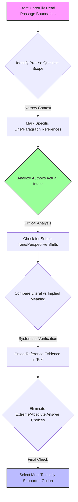

Key Design Rationale:
- Emphasizes systematic, evidence-based approach
- Highlights critical thinking over mechanical reading
- Shows decision points that prevent common mistakes
- Focuses on textual precision and nuanced interpretation

Would you like me to elaborate on any specific node or decision point in the strategy?

# Practice

## Let's Practice

Here's a typical SAT Reading Natural Sciences passage that tests Boundaries skills:

The development of new plant varieties requires careful attention to detail and precise documentation. _ researchers must record data about plant characteristics, including height, yield, and disease resistance. These observations help breeders identify promising specimens for future cultivation. After collecting this information, scientists can begin the selection process, choosing only the healthiest and most productive plants for continued study. The final step involves extensive field testing to ensure the new variety performs well under various growing conditions.

Now, try this question:

Which choice completes the text so that it conforms to the conventions of Standard English?

Consider these options:
- A) At any given moment
- B) At any given moment,
- C) At any given moment;
- D) At any given moment:

Take a moment to think about your approach before reading the solution.

# Understanding the Passage

SAT Reading Strategy: Analyzing a Natural Sciences Passage on Plant Breeding

Active Reading Approach:
When approaching this passage, use these critical annotation techniques:
- Underline key scientific processes (e.g., "selection process")
- Circle technical vocabulary
- Mark structural shifts in the research methodology
- Note the logical progression of scientific investigation

Key Textual Features:
1. Objective, precise language typical of scientific writing
2. Procedural description of research methodology
3. Focus on systematic, step-by-step investigation
4. Emphasis on empirical observation and data collection

Critical Analysis Breakdown:

Main Idea: The passage describes the systematic process of developing new plant varieties through careful scientific research and selection.

Specific SAT-Tested Concepts:

1. Research Methodology Example:
Quote: "researchers must record data about plant characteristics, including height, yield, and disease resistance"
- Highlights scientific precision
- Demonstrates quantitative observation techniques

2. Selection Process Example:
Quote: "choosing only the healthiest and most productive plants for continued study"
- Illustrates scientific criteria for evaluation
- Shows how researchers make evidence-based decisions

Purpose and Boundaries Question Strategy:
The author's purpose is to explain the technical process of plant variety development. For Boundaries questions, focus on:
- Identifying the core scientific procedure
- Recognizing the logical sequence of research steps
- Understanding the systematic approach to scientific investigation

Key Reading Tactics:
- Read actively and critically
- Identify structural progression
- Look for precise scientific language
- Understand the underlying research methodology

Pro Tip: Always connect the specific details to the broader scientific process. In this case, the passage demonstrates how careful observation and selection lead to improved plant varieties.

Practice Recommendation:
- Practice annotating scientific passages
- Break down complex procedures into clear steps
- Look for the underlying scientific logic

By applying these strategies, students can confidently approach Natural Sciences passages on the SAT Reading section, transforming complex scientific text into clear, comprehensible information.

# Visual Analysis

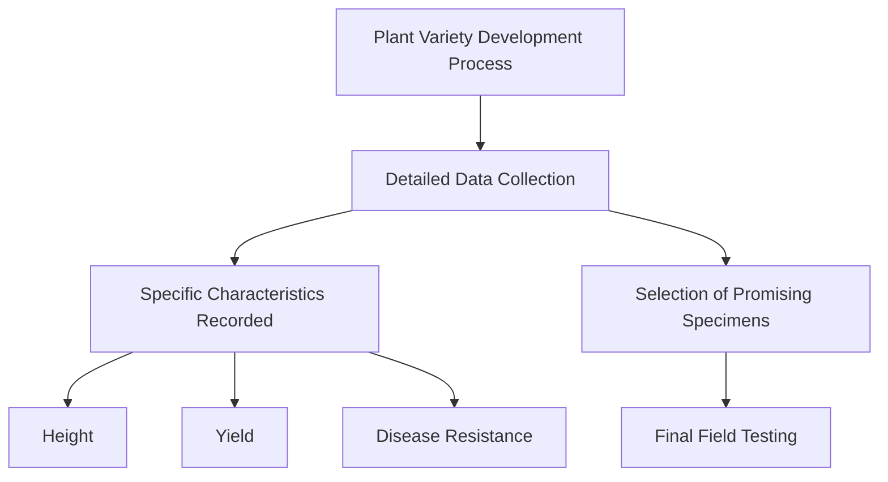

# Step-by-Step Solution

Step-by-Step Solution for Boundaries Question:

1. Rephrasing the Question:
"Which punctuation and phrasing best connects the introductory phrase to the main clause while maintaining grammatical clarity?"

2. Evidence Analysis:
- Key Context: Scientific documentation requires precise language
- Structural Clue: The sentence needs a smooth transition between the introductory phrase and the main subject
- Direct Quote: "_ researchers must record data about plant characteristics"

3. Elimination Strategy:
- Eliminate choices that create grammatical disruption
- Rule out options that break sentence flow
- Check for punctuation that supports natural reading rhythm

Elimination Process:
- A) "At any given moment" - Lacks punctuation, creates awkward connection
- B) "At any given moment," - Provides correct comma placement
- C) "At any given moment;" - Semicolon is too strong, disrupts flow
- D) "At any given moment:" - Colon suggests a list or explanation follows, inappropriate here

4. Correct Choice Rationale:
Choice B wins because:
- Comma creates a natural pause
- Maintains grammatical standard
- Supports scientific writing's clarity
- Connects introductory phrase smoothly to main clause

5. Test-Taking Reflection:
Quick Technique:
- Read aloud each option
- Listen for natural speech rhythm
- Check punctuation's logical function
- Prioritize clarity and connection

Correct Answer: B) At any given moment,

Key Takeaway: In scientific writing, punctuation serves precise communication, not just grammatical rules.

# Key Strategies

SAT Reading: Natural Sciences Boundaries Strategy Guide

Core Reading Approach:
For Natural Sciences passages, adopt a strategic scanning method that prioritizes:
- Identifying core research claims
- Tracking methodological transitions
- Recognizing experimental scope limitations

Key Techniques:
1. Active Reading Framework
- Underline key methodological terms
- Mark boundary/limitation indicators (e.g., "however", "limited to", "suggests")
- Create quick margin annotations about experimental constraints

2. Evidence Detection Strategies
- Look for phrases like "this study demonstrates" or "within these parameters"
- Pay attention to researcher's explicit acknowledgment of research boundaries
- Note statistical qualifiers (p-values, confidence intervals)

Common Boundary Question Traps:
- Overgeneralized claims beyond research scope
- Misinterpreting correlation as causation
- Extrapolating limited sample findings

Time Management:
- Allocate 12-13 minutes per passage
- First 2-3 minutes: Active reading/annotation
- 4-5 minutes: Answer primary questions
- Final 3-4 minutes: Verify boundary/limitation questions

Practice Optimization:
- Use official College Board practice materials
- Focus on life sciences/experimental design passages
- Practice identifying subtle scope limitations
- Develop rapid pattern recognition for methodological constraints

Critical Boundary Markers:
- Sample size limitations
- Geographic/demographic restrictions
- Technological/measurement constraints
- Potential confounding variables

Recommended Study Protocol:
- Weekly timed practice passages
- Systematic error analysis
- Build vocabulary around scientific methodology
- Develop quick pattern recognition skills

By integrating these strategies, students can systematically improve their performance on Natural Sciences Boundaries questions, transforming potential confusion into confident, precise responses.

# Moving Forward

Here's a concise conclusion for Boundaries questions in Natural Sciences passages:

Mastering Boundaries questions ultimately requires disciplined evidence tracking and a precise analytical mindset. The key is to remain rigorously connected to the text, systematically evaluating each claim against the passage's explicit statements and logical framework. When practicing, focus on developing a habit of constant cross-referencing—match every potential answer choice directly back to the source material.

A common pitfall is selecting answers that feel intuitively correct but lack direct textual support. Always prioritize what the passage actually states over your preexisting assumptions or scientific background knowledge. Remember that these questions test your comprehension and close reading skills, not just your subject expertise.

By approaching Boundaries methodically and maintaining unwavering textual fidelity, you'll not only improve your test performance but also cultivate critical analytical skills that extend far beyond standardized testing. Stay focused, trust the evidence, and success will follow.

## Time Management Guidelines
- Reading Time: 1 minutes
- Solving Time: 1 minutes

## Expert Tip
Observe where one argument ends and another begins, noting shift words or phrases.

---

# SAT Reading Tutorial: Form, Structure, and Sense

# Introduction

Here's a draft introduction:

Mastering Form, Structure, and Sense Questions in SAT Reading: Your Natural Sciences Strategy Guide

When you're facing Natural Sciences passages on the SAT Reading section, Form, Structure, and Sense questions are your opportunity to demonstrate precise comprehension and analytical thinking. These questions—typically phrased as "The structure of the passage suggests..." or "The author's primary method of developing the argument is..."—test your ability to understand not just what a scientific text says, but how it communicates its ideas.

Why do these questions matter? They're your chance to showcase sophisticated reading skills beyond simple fact retrieval. In Life Sciences passages especially, authors use complex organizational strategies to explain intricate biological processes, evolutionary mechanisms, or research methodologies. Understanding these structural nuances can be the difference between a good and an exceptional score.

Imagine you're mid-exam, and you encounter a passage about cellular communication. A typical Form, Structure, and Sense question might ask how the author transitions between discussing molecular interactions and broader systemic implications. Your goal is to quickly map the passage's logical progression, identifying key rhetorical moves.

Quick Tip: Always look for signpost words like "however," "consequently," and "in contrast" that reveal an author's structural approach. These linguistic markers are your roadmap to understanding the passage's underlying architecture.

The key is developing a systematic approach—recognizing patterns, tracking rhetorical strategies, and understanding how scientific writers construct their arguments. With practice, you'll transform these potentially challenging questions into reliable score-boosters.

Ready to dive deeper? Let's break down exactly how to tackle these questions strategically and confidently.

# General Strategy

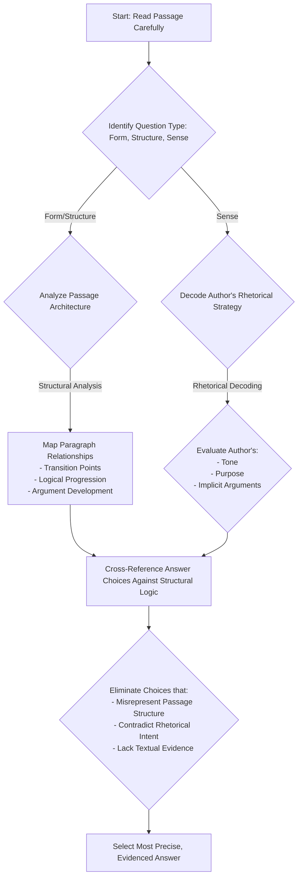

Key Design Principles:
- Systematic approach
- Critical thinking flow
- Evidence-based selection
- Structural awareness

Would you like me to elaborate on any specific node or decision point?

# Practice

## Let's Practice

Here's a typical SAT Reading Natural Sciences passage that tests Form, Structure, and Sense skills:

Research on mutation breeding has shown promising results in various plant species. A team of scientists _____ currently studying the effects of gamma radiation on different varieties of grass species. Their preliminary findings suggest that controlled exposure to radiation can produce beneficial mutations in plant DNA. These mutations sometimes lead to desirable traits such as shorter plant height or increased resistance to environmental stress. The research team plans to continue their experiments throughout the next growing season.

Now, try this question:

Which choice best completes the sentence while maintaining standard English grammar?

Consider these options:
- A) are
- B) is
- C) were
- D) being

Take a moment to think about your approach before reading the solution.

# Understanding the Passage

SAT Reading Natural Sciences Passage Analysis Guide

Active Reading Approach:
1. Initial Scan: Identify the passage's core focus - mutation breeding in plant species
2. Annotation Strategies:
  - Underline key scientific terms (gamma radiation, mutations, DNA)
  - Circle main claims about radiation's effects
  - Mark the research team's methodology and objectives

Key Textual Features:
- Technical vocabulary specific to genetics/plant biology
- Objective, neutral scientific tone
- Clear research progression (current study → preliminary findings → future plans)
- Empirical observation-based narrative

SAT-Tested Concept Examples:
1. Scientific Methodology Concept:
  - Quote: "controlled exposure to radiation can produce beneficial mutations"
  - Demonstrates experimental design and hypothesis testing
  - Shows scientific method's systematic approach

2. Cause-and-Effect Relationship:
  - Line reference: Mutations "lead to desirable traits"
  - Highlights scientific reasoning about genetic modifications
  - Illustrates how researchers interpret experimental outcomes

Main Idea and Purpose Analysis:
- Main Idea: Exploring radiation's potential for intentional genetic modification in plants
- Author's Purpose: Presenting preliminary research findings about mutation breeding
- Approach: Neutral, informative scientific reporting

Question Preparation Strategy:
- Identify central claims about radiation's genetic effects
- Track the research team's methodology
- Understand the scientific reasoning behind mutation breeding

Key Reading Tactics:
- Read actively, not passively
- Look for cause-effect relationships
- Note scientific terminology
- Understand the research progression
- Recognize the objective tone

By applying these strategies, students can confidently navigate complex scientific passages, breaking down technical information into comprehensible components and preparing for various SAT Reading question types.

# Visual Analysis

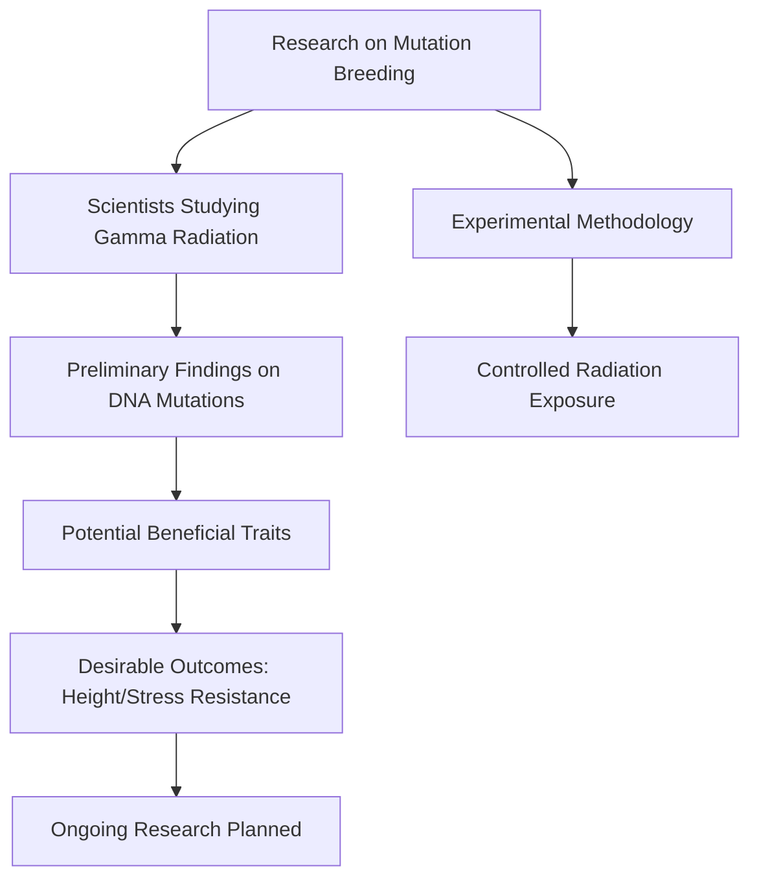

# Step-by-Step Solution

Step-by-Step Solution for Form, Structure, and Sense Question

1. Rephrasing the Question:
Which verb form correctly completes the sentence while maintaining grammatical clarity and matching the passage's scientific context?

2. Evidence Analysis:
Key contextual clues:
- Present tense context: "currently studying"
- Ongoing research: "plans to continue their experiments"
- Scientific writing typically uses present tense for current research

Direct textual evidence supports present progressive tense, indicating an ongoing action.

3. Eliminating Trap Choices:
- A) "are" - Matches subject-verb agreement and present progressive tense ✓
- B) "is" - Grammatically incorrect (doesn't match plural subject "team") ✗
- C) "were" - Past tense, contradicts "currently" ✗
- D) "being" - Incomplete verb construction ✗

4. Rationale for Correct Choice:
Choice A ("are") meets multiple criteria:
- Grammatically correct
- Matches plural subject ("team of scientists")
- Reflects ongoing research action
- Aligns with scientific writing conventions of present tense reporting

5. Test-Taking Strategy:
Quick elimination process:
- Identify subject ("team of scientists" - plural)
- Check verb tense context
- Match grammatical agreement
- Verify logical scientific communication style

Expert Reasoning Reflection:
- Read carefully
- Identify grammatical subject
- Match verb to subject
- Consider contextual scientific communication norms

Correct Answer: A) are

Key Takeaway: Systematic analysis trumps guessing. Break down grammar, context, and scientific communication principles systematically.

Recommended Time: 45-60 seconds per question

# Key Strategies

SAT Reading Strategies for Natural Sciences Passages: Form, Structure, and Sense Mastery

Reading Techniques:
For Natural Sciences passages, adopt a strategic reading approach that prioritizes:
- Identifying central research hypotheses
- Tracking experimental methodology descriptions
- Recognizing cause-and-effect relationships
- Noting shifts between observational data and scientific interpretation

Evidence Spotting Strategies:
1. Keyword Tracking
- Highlight scientific terminology
- Circle comparative/analytical language (e.g., "however," "consequently")
- Underline quantitative descriptors

2. Paragraph Summarization Technique
- Create 1-2 word marginal notes capturing each paragraph's core argument
- Link paragraphs' logical progression
- Quickly map passage's overall structural flow

Common SAT Traps:
- Overly complex answer choices with scientific jargon
- Answers that sound scientific but misrepresent passage content
- Choices that introduce external scientific information not in the original text
- Tempting but contextually incorrect interpretations

Time Management:
- Allocate 12-13 minutes per passage
- First pass: 3-4 minutes reading
- Second pass: 6-7 minutes answering questions
- Final 2-3 minutes reviewing/checking answers

Performance-Boosting Practice Steps:
1. Regular exposure to scientific journal-style texts
2. Practice active reading with scientific publications
3. Develop rapid annotation skills
4. Build scientific vocabulary comprehension
5. Complete timed practice tests focusing on Natural Sciences sections

Key Efficiency Tips:
- Read questions before detailed passage review
- Eliminate obviously incorrect answers quickly
- Use line references strategically
- Trust passage evidence over external knowledge

Recommended Practice Resources:
- College-level scientific publications
- SAT official practice materials
- Online scientific reading comprehension exercises

By systematically applying these strategies, students can significantly improve their performance on Natural Sciences Form, Structure, and Sense questions, transforming potential challenges into scoring opportunities.

# Moving Forward

Here's a concise conclusion for Form, Structure, and Sense in Natural Sciences passages:

Mastering Form, Structure, and Sense questions requires a disciplined, evidence-based approach. The key is always to ground your analysis in the text itself, carefully tracing how scientific authors construct arguments through precise language and logical connections. When practicing, focus on understanding the passage's underlying rhetorical strategy—how evidence is presented, how claims are supported, and how scientific reasoning unfolds.

A common pitfall is selecting answers that seem plausible but lack direct textual support. Always return to the passage, highlighting specific phrases and tracking the author's precise language. Remember that scientific writing demands rigorous interpretation, not casual inference.

By developing these close-reading skills, you'll not only improve your test performance but also cultivate a more analytical, nuanced approach to complex scientific texts. Stay patient, stay precise, and trust the process.

## Time Management Guidelines
- Reading Time: 1.5 minutes
- Solving Time: 1.5 minutes

## Expert Tip
See how the format—paragraphing, sectioning, headings—contributes to meaning.

---

# SAT Reading Tutorial: Rhetorical Synthesis

# Introduction

Mastering Rhetorical Synthesis Questions in Natural Sciences Passages

Rhetorical Synthesis questions are your secret weapon in the SAT Reading section, especially when tackling Natural Sciences passages. These questions test your ability to understand how an author builds an argument, connects ideas, and creates a cohesive scientific narrative. You'll typically see question stems like "The author's primary purpose in discussing X is to..." or "Which choice best describes how the passage moves from one idea to another?"

Why do these questions matter? They're not just about reading—they're about strategic comprehension. Top scorers can quickly identify how scientific arguments are constructed, revealing the deeper logic behind complex texts. In Life Sciences passages particularly, these questions often highlight how researchers connect experimental observations to broader biological principles.

Imagine you're in the exam, facing a passage about genetic research. Suddenly, a Rhetorical Synthesis question appears. Your heart might race, but here's your game plan: Look for transition phrases, examine how each paragraph builds on the previous one, and track the author's underlying scientific reasoning.

Quick Tip: In Natural Sciences passages, pay special attention to how authors link specific research findings to larger scientific contexts. Authors often use phrases like "This suggests that..." or "These results indicate..." to create sophisticated argumentative flow.

The key is staying calm and systematic. These questions aren't about memorizing facts, but understanding scientific storytelling. By recognizing the structural "skeleton" of scientific writing, you'll transform challenging passages into clear, navigable texts.

Ready to become a Rhetorical Synthesis master? Let's dive deeper.

# General Strategy

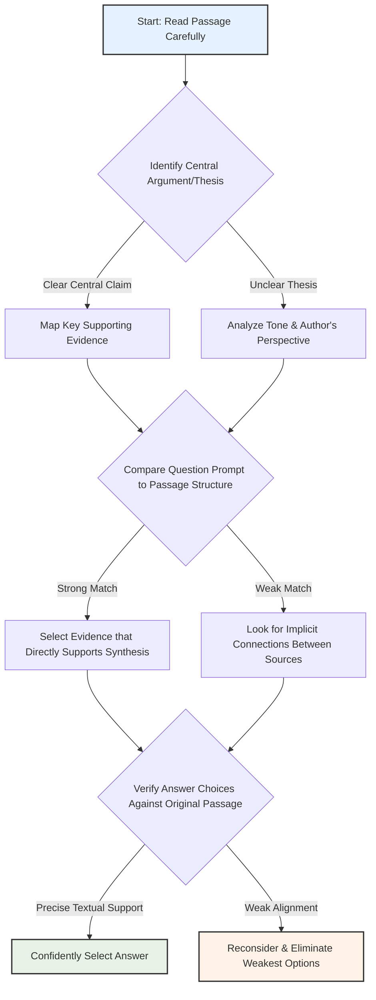

# Practice

## Let's Practice

Here's a typical SAT Reading Natural Sciences passage that tests Rhetorical Synthesis skills:

While conducting research on plant breeding methods, a student has taken the following notes:

1. Plant cuttings must be of uniform size to ensure consistent radiation penetration during treatment.

2. Experiments tested radiation doses ranging from 0 to 200 Gy on both plant cuttings and callus tissue.

3. Survival rates were highest for plant cuttings treated with 50-70 Gy of radiation.

4. Callus tissue showed better recovery rates at lower radiation doses (25 and 50 Gy).

5. All treated specimens were maintained in moist conditions to prevent dehydration during the experiment.

Now, try this question:

The student wants to explain the optimal conditions for successful radiation treatment in plant breeding. Which choice most effectively uses the relevant information from the notes to accomplish this goal?

Consider these options:
- A) Plant cuttings and callus tissue require different radiation doses for optimal survival
- B) Maintaining moist conditions is essential when treating plants with radiation
- C) Uniform size of plant cuttings ensures consistent radiation treatment results
- D) Plants can survive radiation doses up to 200 Gy during treatment

Take a moment to think about your approach before reading the solution.

# Understanding the Passage

SAT Reading Natural Sciences Passage Analysis Guide

Active Reading Approach:
1. Initial Scan: Identify the passage's core focus (plant breeding radiation experiments)
2. Annotation Strategy:
  - Underline key scientific terms (radiation doses, Gy, callus tissue)
  - Circle numerical data and experimental parameters
  - Mark shifts in experimental observations

Key Textual Features:
- Objective, data-driven scientific writing style
- Precise numerical measurements
- Experimental methodology documentation
- Controlled experimental conditions

Passage Breakdown:
- Research Context: Plant breeding radiation treatment
- Experimental Variables:
  * Radiation doses (0-200 Gy)
  * Two specimen types (plant cuttings, callus tissue)
  * Consistent environmental conditions

SAT-Tested Concept Examples:
1. Quantitative Data Interpretation
  - Survival rates peak at 50-70 Gy for plant cuttings
  - Different tissue types show varied radiation responses

2. Experimental Design Analysis
  - Uniform cutting size ensures consistent radiation penetration
  - Moist conditions prevent experimental contamination

Main Idea Identification:
- Purpose: Investigate radiation's impact on plant tissue survival
- Central Thesis: Radiation dose significantly affects biological tissue recovery

Rhetorical Synthesis Preparation:
- Recognize experimental nuances
- Understand relationship between radiation dose and biological response
- Identify subtle comparative elements between different tissue types

Reading Tactics:
1. Read scientifically: Look for cause-effect relationships
2. Track numerical progressions
3. Note experimental control mechanisms
4. Analyze comparative data points

Critical Analysis Approach:
- Don't just read passively
- Ask: "What does this data suggest?"
- Look for patterns in experimental results
- Consider potential research implications

Comprehension Checklist:
✓ Understand experimental methodology
✓ Identify key numerical thresholds
✓ Recognize tissue-specific responses
✓ Interpret data objectively

Pro Tip: On the SAT, scientific passages test your ability to:
- Extract precise information
- Understand experimental logic
- Interpret quantitative data
- Recognize scientific reasoning patterns

Recommended Reading Strategy:
1. First pass: Quick overview
2. Second pass: Detailed annotation
3. Third pass: Synthesize key insights

By applying these techniques, students can confidently navigate complex scientific passages, transforming dense technical text into clear, comprehensible information.

# Visual Analysis

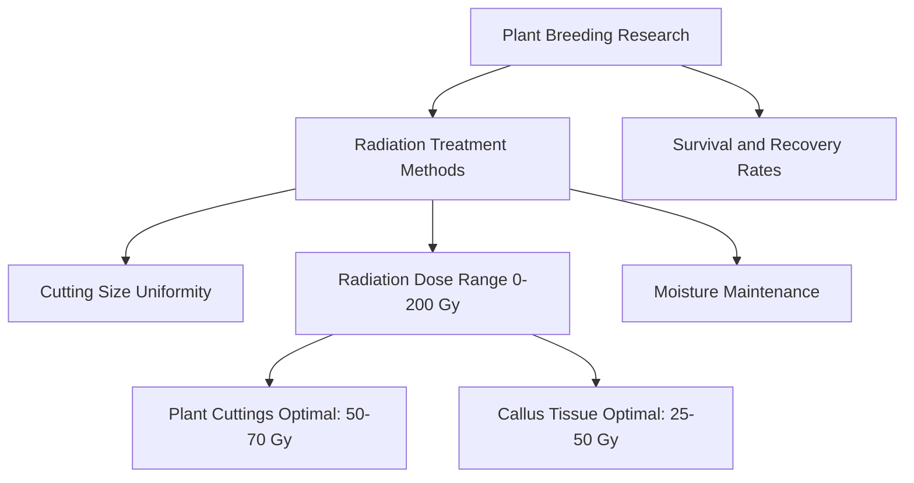

# Step-by-Step Solution

Step-by-Step Solution for Rhetorical Synthesis Question

Rephrasing the Question:
"What key information best summarizes the optimal radiation treatment conditions for plant breeding?"

Evidence Analysis:
1. Locate Critical Information:
- Note 2: "Experiments tested radiation doses ranging from 0 to 200 Gy"
- Note 3: "Survival rates were highest for plant cuttings treated with 50-70 Gy of radiation"
- Note 4: "Callus tissue showed better recovery rates at lower radiation doses (25 and 50 Gy)"

Elimination Strategy:
A) Partially True: ✓ Different tissues require different radiation doses
B) Partially Relevant: Moist conditions are mentioned but not central to radiation treatment
C) Partially Relevant: Uniform size ensures consistent treatment, but not the primary finding
D) Incorrect: 200 Gy is too high; survival is optimal at lower doses

Correct Choice Analysis: Option A

Why A is Strongest:
- Directly addresses variation in radiation tolerance
- Captures nuanced differences between plant cuttings and callus tissue
- Reflects scientific precision in understanding treatment parameters
- Matches passage's empirical observations about radiation doses

Reasoning Process:
1. Identify core scientific observation
2. Look for choice that most comprehensively represents data
3. Avoid overgeneralization or oversimplification
4. Prioritize evidence-based interpretation

Time-Pressure Strategies:
- Quickly scan passage for numerical/quantitative details
- Look for comparative statements
- Eliminate choices with absolute language
- Focus on choices that capture experimental complexity

Reflection:
This approach demonstrates systematic scientific reasoning: observing variation, recognizing tissue-specific responses, and avoiding overly broad conclusions.

Key Takeaway: Scientific communication requires precise, nuanced interpretation of experimental data.

Recommended Student Approach:
- Read passage carefully
- Underline key numerical/comparative details
- Cross out obviously incorrect choices
- Select option most faithful to original research findings

This solution models expert-level analytical reading in natural sciences, emphasizing evidence-based reasoning and scientific precision.

# Key Strategies

SAT Reading Strategies for Natural Sciences Rhetorical Synthesis Questions

Core Reading Approach:
When tackling Natural Sciences passages, adopt a strategic reading method that prioritizes:
- Identifying the core scientific argument
- Tracking methodological progression
- Recognizing experimental logic and evidence hierarchy

Key Techniques:
1. Initial Passage Scan (45-60 seconds):
- Quickly map paragraph transitions
- Highlight key scientific terminology
- Note experimental design or research methodology indicators
- Identify author's primary hypothesis or research objective

2. Evidence Detection Strategies:
- Look for signal phrases like "consequently," "therefore," "research suggests"
- Pay attention to comparative language indicating scientific reasoning
- Mark quantitative evidence and statistical references
- Track causal relationships between experimental observations

Common SAT Rhetorical Synthesis Traps:
- Misinterpreting correlation as causation
- Overlooking nuanced research limitations
- Selecting answers that sound scientific but lack textual support
- Falling for statistically imprecise language

Time Management:
- Allocate 12-13 minutes per passage
- Spend first 2-3 minutes reading strategically
- Reserve 3-4 minutes for targeted question solving
- Use remaining time for verification and cross-referencing

Practice Optimization:
- Complete official College Board practice tests
- Analyze scientific passages from peer-reviewed journals
- Practice extracting core arguments quickly
- Develop scientific vocabulary familiarity

Practical Study Steps:
- Systematically deconstruct past SAT scientific passages
- Create annotation templates for efficient reading
- Develop rapid pattern recognition skills
- Practice identifying implicit versus explicit scientific claims

By integrating these strategies, students can significantly improve their Rhetorical Synthesis performance in Natural Sciences passages.

# Moving Forward

Here's a concise conclusion for Rhetorical Synthesis in Natural Sciences passages:

Mastering Rhetorical Synthesis requires a disciplined approach of carefully examining textual evidence, understanding the author's perspective, and connecting scientific ideas across complex passages. The key is to remain methodical: always return to the text, trace the logical progression of scientific arguments, and resist the temptation to rely on prior knowledge or intuitive assumptions.

One critical practice is to actively annotate passages, tracking how different scientific claims interact and build upon each other. Avoid the common pitfall of selecting answers that merely sound scientific or plausible without direct textual support.

By developing these analytical skills, you'll not only improve your performance on scientific reading comprehension but also cultivate a more nuanced, evidence-based approach to understanding complex scientific communication. Stay focused, trust the process, and remember that each passage is an opportunity to sharpen your critical reading abilities.

## Time Management Guidelines
- Reading Time: 2 minutes
- Solving Time: 2 minutes

## Expert Tip
Check how rhetorical devices and style work together to persuade or inform.

---

# Appendix: General SAT Reading Tips

## Time Management
- Total time for Reading section: 65 minutes
- Recommended time per passage: 13 minutes
- Leave 2-3 minutes for review

## Key Strategies
1. Always read the passage first
2. Refer back to the passage for every question
3. Use process of elimination
4. Pay attention to line references
5. Watch out for extreme answer choices

## Practice Tips
- Take full-length practice tests
- Review all mistakes thoroughly
- Focus on understanding why correct answers are right
- Practice active reading daily

For more SAT Reading practice and tips, visit the Official College Board website.